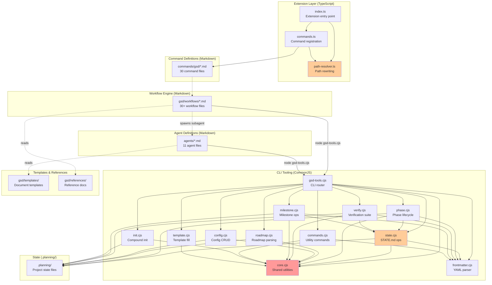

# Component Decomposition

> **Key Takeaways:**
> - 6 top-level modules with clear boundaries: Extension, Commands, Workflows, Agents, CLI, Templates
> - The CLI tooling layer (`gsd/bin/lib/`) has 11 internal modules with a shared `core.cjs` foundation
> - Hotspots: `core.cjs` (everything depends on it), `state.cjs` (frontmatter sync complexity), `phase.cjs` (renumbering fragility)
> - The path resolver is the single most critical component — if it breaks, all commands fail

## Component Dependency Graph



_Red = highest coupling. Orange = notable complexity._

## Module Breakdown

### Extension Layer (`extensions/gsd/`)

| File | Responsibility | Key Exports |
|------|---------------|-------------|
| `index.ts` | Extension entry point. Initializes resolver, registers commands, subscribes to 3 events | `default function(pi: ExtensionAPI)` |
| `commands.ts` | Discovers `commands/gsd/*.md`, parses frontmatter, registers Pi commands | `registerGsdCommands(pi, resolver): number` |
| `path-resolver.ts` | 4-rule path rewriting + execution context transform + argument injection | `class GsdPathResolver` |

**Boundaries:**
- Only module that imports from `@mariozechner/pi-coding-agent`
- Only module that uses TypeScript
- No direct filesystem access to `.planning/` — that's the CLI's job

**Invariants:**
- Path resolver must be initialized before command registration
- Commands must re-read `.md` files at invocation time (hot-reload support)
- Event handlers must check for `.planning/` existence before injecting GSD context

### CLI Tooling (`gsd/bin/`)

#### `gsd-tools.cjs` — CLI Router

The main entry point. Routes `process.argv` to handler functions across 11 library modules.

**Key behavior:**
- Supports `--cwd` flag to override working directory (for sandboxed subagents)
- Supports `--raw` flag for machine-readable output (single values instead of JSON)
- Large JSON outputs (>50KB) written to temp file, path returned as `@file:/tmp/gsd-*.json`
- All output goes to stdout as JSON; errors to stderr via `error()`

#### `core.cjs` — Shared Foundation

**Everything depends on this module.** Provides:

| Export | Purpose |
|--------|---------|
| `MODEL_PROFILES` | Agent → model mapping table (quality/balanced/budget) |
| `output(result, raw, rawValue)` | JSON output with large-payload temp file fallback |
| `error(message)` | stderr + `process.exit(1)` |
| `safeReadFile(path)` | Returns `null` on failure, never throws |
| `loadConfig(cwd)` | Reads `.planning/config.json` with defaults |
| `execGit(cwd, args)` | Safe git execution, returns `{exitCode, stdout, stderr}` |
| `findPhaseInternal(cwd, phase)` | Phase directory lookup with archive search |
| `resolveModelInternal(cwd, agentType)` | Model resolution with override support |
| `normalizePhaseName(phase)` | Pad phase numbers (e.g., `1` → `01`) |
| `comparePhaseNum(a, b)` | Sort phases: integers, decimals, letter suffixes |
| `getMilestoneInfo(cwd)` | Extract current milestone version/name from ROADMAP.md |
| `getMilestonePhaseFilter(cwd)` | Filter function for current-milestone phases |

#### `state.cjs` — STATE.md Operations

Manages the project's living memory file. Critical complexity: **frontmatter sync**.

Every write to STATE.md body triggers `writeStateMd()` which:
1. Reads the entire file
2. Parses body to extract current values (phase, plan, progress, etc.)
3. Rebuilds YAML frontmatter from body values
4. Writes file with synchronized frontmatter + body

**Key commands:** `cmdStateUpdate`, `cmdStatePatch`, `cmdStateAdvancePlan`, `cmdStateRecordMetric`, `cmdStateAddDecision`, `cmdStateAddBlocker`

#### `phase.cjs` — Phase Lifecycle

CRUD operations on phase directories and ROADMAP.md entries.

**Key commands:**
- `cmdPhaseAdd` — append new phase to roadmap
- `cmdPhaseInsert` — insert decimal phase (e.g., 7.1 between 7 and 8)
- `cmdPhaseRemove` — remove phase with full renumbering (⚠️ fragile — renames dirs, files, roadmap refs)
- `cmdPhaseComplete` — mark phase done, update state + roadmap
- `cmdPhasePlanIndex` — index plans with wave grouping and completion status

#### `roadmap.cjs` — Roadmap Parsing

Extracts structured data from `ROADMAP.md` using regex pattern matching.

**Key commands:** `cmdRoadmapGetPhase`, `cmdRoadmapAnalyze`, `cmdRoadmapUpdatePlanProgress`

⚠️ **Fragile:** Depends on specific markdown heading formats (`### Phase N: Name`). User-edited roadmaps may break parsing.

#### `frontmatter.cjs` — YAML Parser

**Custom YAML parser** (not a standard library). Handles:
- Key-value pairs
- Inline arrays (`[a, b, c]`)
- Multi-line arrays (`- item`)
- 2-level nested objects
- Quote stripping

⚠️ **Known limitation:** Does not handle multi-line strings, anchors, or deep nesting (>3 levels). See [ADR-001](../adr/001-custom-yaml-parser.md).

**Key exports:** `extractFrontmatter(content)`, `reconstructFrontmatter(obj)`, `parseMustHavesBlock(content)`

#### Other Modules

| Module | Purpose | Key Commands |
|--------|---------|-------------|
| `config.cjs` | Config CRUD with dot-notation paths | `cmdConfigSet`, `cmdConfigGet`, `cmdConfigEnsureSection` |
| `verify.cjs` | Summary verification, plan structure checks, health validation | `cmdVerifySummary`, `cmdVerifyPlanStructure`, `cmdValidateHealth` |
| `template.cjs` | Template selection and variable interpolation | `cmdTemplateFill`, `cmdTemplateSelect` |
| `milestone.cjs` | Milestone archival, requirements marking | `cmdMilestoneComplete`, `cmdRequirementsMarkComplete` |
| `commands.cjs` | Standalone utilities (slug, timestamp, todos, commit, progress) | `cmdCommit`, `cmdListTodos`, `cmdProgressRender` |
| `init.cjs` | Compound init commands — assembles all context for a workflow | `cmdInitExecutePhase`, `cmdInitPlanPhase`, `cmdInitNewProject` |

### Command Definitions (`commands/gsd/`)

30 markdown files, each defining a slash command. Structure:

```yaml
---
name: gsd:plan-phase
description: Create detailed phase plan
argument-hint: "[phase] [--auto] [--research]"
agent: gsd-planner           # optional — subagent to spawn
allowed-tools:                # optional — tools the agent can use
  - Read
  - Write
  - Bash
---
<objective>...</objective>
<execution_context>
@~/.claude/get-shit-done/workflows/plan-phase.md
</execution_context>
<process>...</process>
```

**Data ownership:** Commands own their frontmatter metadata. The extension reads it for registration but never modifies it.

### Workflow Engine (`gsd/workflows/`)

30+ markdown files that define multi-step orchestration logic. The LLM reads these as instructions and follows them. Workflows:

- Call `gsd-tools.cjs` for deterministic operations
- Spawn subagents via `Task()` calls
- Present information to the user
- Manage state transitions

**Data ownership:** Workflows don't own data — they coordinate reads/writes to `.planning/`.

### Agent Definitions (`agents/`)

11 markdown files defining specialized LLM roles:

| Agent | Role | Spawned By |
|-------|------|-----------|
| `gsd-planner` | Creates executable PLAN.md files | `plan-phase` workflow |
| `gsd-executor` | Executes PLAN.md with atomic commits | `execute-phase` workflow |
| `gsd-verifier` | Goal-backward phase verification | `verify-work` workflow |
| `gsd-debugger` | Systematic debugging with persistent state | `debug` command |
| `gsd-roadmapper` | Creates ROADMAP.md from requirements | `new-project` workflow |
| `gsd-phase-researcher` | Phase-level domain research | `plan-phase` workflow |
| `gsd-project-researcher` | Project-level domain research | `new-project` workflow |
| `gsd-research-synthesizer` | Synthesizes research outputs | `new-project` workflow |
| `gsd-plan-checker` | Verifies plan quality | `plan-phase` workflow |
| `gsd-codebase-mapper` | Analyzes existing codebase | `map-codebase` workflow |
| `gsd-integration-checker` | Cross-phase integration wiring | `audit-milestone` workflow |

## Hotspots and Stability Risks

### 🔴 Critical — `core.cjs`

Every CLI module depends on `core.cjs`. Changes here affect everything. Key risks:
- `MODEL_PROFILES` table — adding/removing agents requires updating this
- `loadConfig()` — config schema changes ripple to all init commands
- `findPhaseInternal()` — phase directory naming convention is baked in
- `comparePhaseNum()` — sorting logic handles integers, decimals, letter suffixes — complex regex

**Mitigation:** Add unit tests for `comparePhaseNum`, `normalizePhaseName`, `loadConfig` before modifying.

### 🟡 Moderate — Phase Renumbering (`phase.cjs:cmdPhaseRemove`)

Renames directories AND files AND updates ROADMAP.md references AND STATE.md — a multi-file atomic operation with regex-based text replacement. Test with multiple phase types before changing.

### 🟡 Moderate — STATE.md Frontmatter Sync (`state.cjs:writeStateMd`)

The frontmatter sync logic (`buildStateFrontmatter`) parses the markdown body to extract field values, then reconstructs YAML frontmatter. If body format changes, sync breaks silently.

### 🟡 Moderate — Path Resolver Pipeline (`path-resolver.ts`)

The 4-rule rewrite order matters. Rule 1 (`@~/.claude/get-shit-done/`) must run before Rule 3 (`~/.claude/get-shit-done/`) to prevent partial matches on the `@` prefix. Well-tested but fragile if rules are reordered.

### 🟢 Stable — Extension Entry Point (`index.ts`)

Simple, well-tested. Only 3 event handlers with clear preconditions (`.planning/` directory must exist).

### 🟢 Stable — Command Registration (`commands.ts`)

Straightforward file discovery + frontmatter parsing. Re-reads at invocation time for hot-reload.
