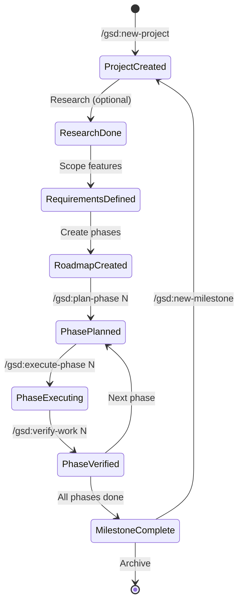
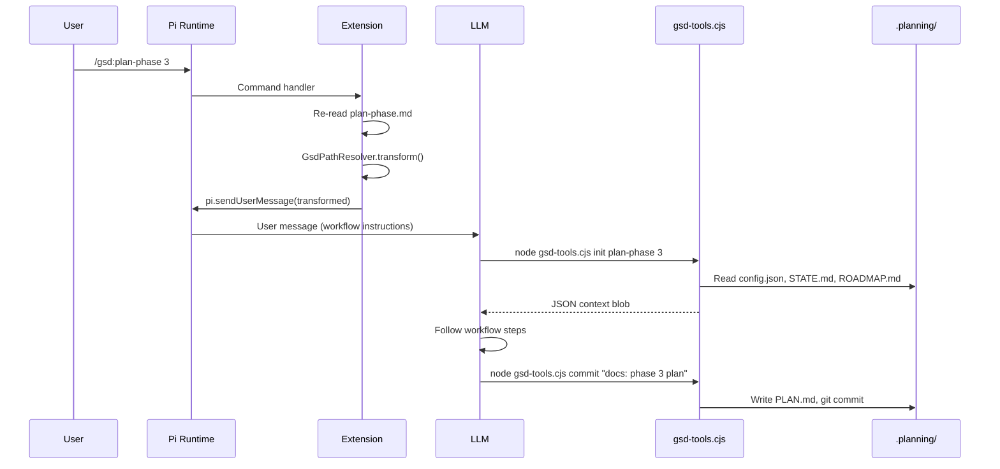
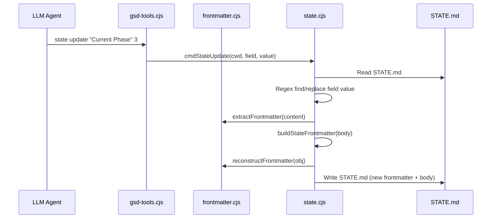
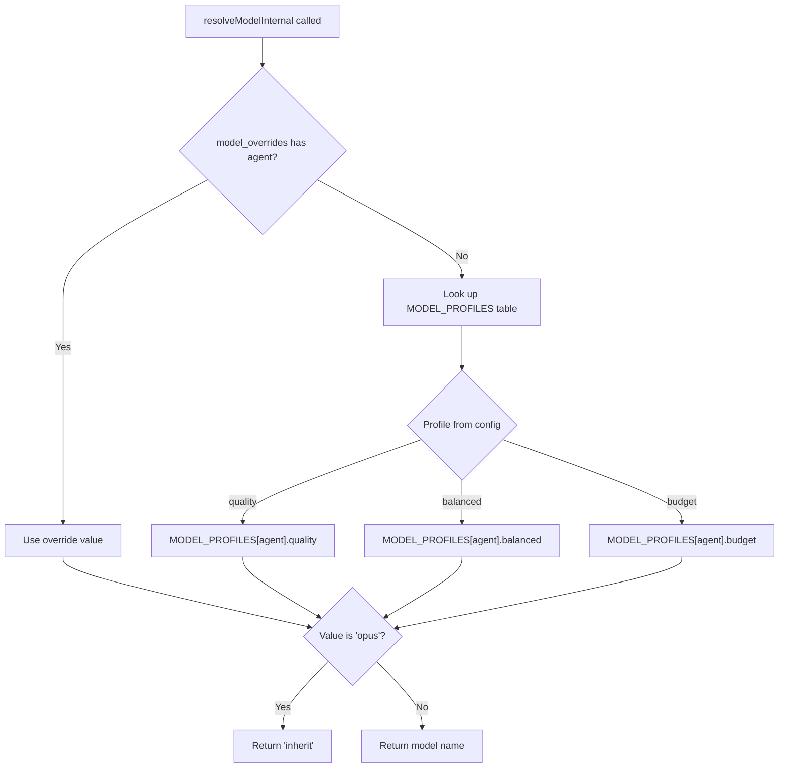
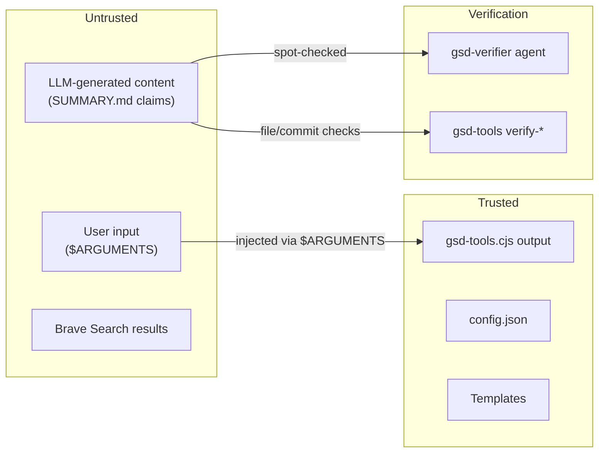

# Data Flow & State

> **Key Takeaways:**
> - All state lives in `.planning/` as files — no database, no in-memory state across sessions
> - STATE.md has dual representation: YAML frontmatter (machine-readable) + markdown body (human-readable), kept in sync
> - Config cascades: hardcoded defaults → `~/.gsd/defaults.json` → `.planning/config.json` → per-agent overrides
> - Trust boundary: LLM-generated content (SUMMARY.md claims) is untrusted by the verifier

## Key Data Entities

### `.planning/` Directory Tree

```
.planning/
├── PROJECT.md            # Vision, core value, high-level requirements
├── ROADMAP.md            # Phase structure with goals and success criteria
├── REQUIREMENTS.md       # Scoped requirements with REQ-IDs and traceability
├── STATE.md              # Living project memory (position, decisions, blockers)
├── config.json           # Workflow preferences and model profile
├── RETROSPECTIVE.md      # Living retrospective (updated per milestone)
├── research/             # Project-level research outputs
│   ├── STACK.md
│   ├── FEATURES.md
│   ├── ARCHITECTURE.md
│   ├── PITFALLS.md
│   └── SUMMARY.md
├── codebase/             # Codebase map (brownfield projects)
│   ├── ARCHITECTURE.md
│   ├── STACK.md
│   ├── STRUCTURE.md
│   ├── CONVENTIONS.md
│   ├── TESTING.md
│   ├── INTEGRATIONS.md
│   └── CONCERNS.md
├── phases/               # Per-phase execution artifacts
│   ├── 01-foundation/
│   │   ├── 01-01-PLAN.md
│   │   ├── 01-01-SUMMARY.md
│   │   ├── 01-CONTEXT.md
│   │   ├── 01-RESEARCH.md
│   │   └── 01-VERIFICATION.md
│   └── 02-core/
│       └── ...
├── quick/                # Quick task artifacts
│   └── 001-fix-bug/
│       ├── PLAN.md
│       └── SUMMARY.md
├── todos/
│   ├── pending/          # Active todo items
│   └── done/             # Completed todos
├── debug/                # Active debug sessions
│   └── resolved/         # Archived debug sessions
└── milestones/           # Archived milestone data
    ├── v1.0-ROADMAP.md
    ├── v1.0-REQUIREMENTS.md
    └── v1.0-phases/      # Archived phase directories
```

### Entity Lifecycle



## Data Schemas

### `config.json`

```json
{
  "mode": "interactive|yolo",
  "depth": "quick|standard|comprehensive",
  "model_profile": "quality|balanced|budget",
  "commit_docs": true,
  "search_gitignored": false,
  "branching_strategy": "none|phase|milestone",
  "phase_branch_template": "gsd/phase-{phase}-{slug}",
  "milestone_branch_template": "gsd/{milestone}-{slug}",
  "workflow": {
    "research": true,
    "plan_check": true,
    "verifier": true,
    "auto_advance": false,
    "nyquist_validation": false
  },
  "parallelization": true,
  "model_overrides": {
    "gsd-executor": "opus"
  }
}
```

**Source:** `gsd/templates/config.json` (full template), `gsd/bin/lib/core.cjs:loadConfig()` (parser with defaults).

**Config cascade:**
1. Hardcoded defaults in `core.cjs:loadConfig()`
2. User-level defaults from `~/.gsd/defaults.json` (if exists)
3. Project-level config from `.planning/config.json`
4. Per-agent model overrides via `model_overrides` key

### STATE.md Structure

STATE.md has **dual representation**: YAML frontmatter (for `gsd-tools.cjs` to parse) and markdown body (for humans and LLMs to read). The `writeStateMd()` function keeps them in sync.

**Frontmatter (machine-readable):**
```yaml
---
phase: 3
plan: 2
status: executing
progress: 45
milestone: v1.0
---
```

**Body (human/LLM-readable):**
```markdown
# Project State

**Current Phase:** 3
**Current Plan:** 2
**Status:** executing
**Progress:** ████░░░░░░ 45%

## Decisions
| Decision | Phase | Rationale |
|----------|-------|-----------|
| Use SQLite | 1 | Simplicity over Postgres |

## Blockers
- API rate limiting discovered in phase 2

## Session Continuity
**Last stopped at:** Phase 3, Plan 2, Task 4
**Resume file:** .planning/phases/03-api/continue-here.md
```

### PLAN.md Structure

```yaml
---
phase: 1
plan: 1
type: execute
autonomous: true
wave: 1
depends_on: []
---
# Plan: Build authentication system

## Objective
[What this plan achieves]

## Context
[Files to read, background information]

## Tasks
1. [Task description]
   - Type: code|test|config
   - Files: src/auth.ts
2. [Task description]
   ...

## Must-Haves
### Artifacts
- src/auth.ts
- src/auth.test.ts

### Key Links
- Login form submits to /api/auth/login

## Success Criteria
1. User can log in with email/password
2. Session persists across browser refresh
```

### SUMMARY.md Structure

```yaml
---
phase: 1
plan: 1
status: complete
tasks_completed: 5
files_modified: 8
commit_hashes: [abc1234, def5678]
---
# Summary: Authentication System

## What Was Built
[Description of implementation]

## Files Created/Modified
- `src/auth.ts` — Authentication service
- `src/auth.test.ts` — Tests

## Commits
- abc1234: feat: add login endpoint
- def5678: feat: add session management

## Self-Check
- [x] All tasks completed
- [x] Tests passing
- [x] Commits verified
```

## Data Flow Diagrams

### Command Invocation Data Flow



### State Update Data Flow



### Model Resolution Data Flow



**Why `inherit` for opus?** Organizations may block specific opus versions. Returning `inherit` makes the subagent use whatever opus version the user's session has configured, avoiding version conflicts. Evidence: `gsd/references/model-profiles.md`, `gsd/bin/lib/core.cjs:resolveModelInternal()`.

## Persistence Strategy

### Write Patterns

| Who Writes | What | How |
|-----------|------|-----|
| `gsd-tools.cjs` | config.json, STATE.md | Direct `fs.writeFileSync` |
| LLM agents | PLAN.md, SUMMARY.md, VERIFICATION.md | `Write` tool (via Pi) |
| `gsd-tools.cjs` | Git commits | `execSync('git add/commit')` |
| `gsd-tools.cjs` | Template fills | Read template, interpolate, write |

### Read Patterns

| Who Reads | What | How |
|-----------|------|-----|
| Init commands | config.json, STATE.md, ROADMAP.md | `loadConfig()`, `safeReadFile()` |
| LLM agents | Any `.planning/` file | `Read` tool (via Pi) |
| Verify commands | SUMMARY.md, PLAN.md | `fs.readFileSync` |

### Concurrency

**No concurrent access is expected.** GSD runs inside a single Pi session. Subagents spawned by workflows run one at a time (or in parallel waves, but writing to different phase directories).

**Risk:** If two subagents in the same wave both update STATE.md, last write wins. Current mitigation: STATE.md updates happen in the orchestrator, not in subagents.

## Input Validation & Trust Boundaries



**Key trust boundary:** The gsd-verifier agent explicitly does NOT trust SUMMARY.md claims. From `agents/gsd-verifier.md`: _"Do NOT trust SUMMARY.md claims. SUMMARYs document what Claude SAID it did. You verify what ACTUALLY exists in the code."_

**Input validation points:**
- `$ARGUMENTS` — injected via `path-resolver.ts:injectArguments()`. No sanitization beyond `split/join` replacement.
- Phase numbers — normalized via `normalizePhaseName()` (pad to 2 digits, uppercase letter suffix)
- Config values — `cmdConfigSet()` parses booleans and numbers from strings
- File paths — `safeReadFile()` returns null on access failure, never throws
