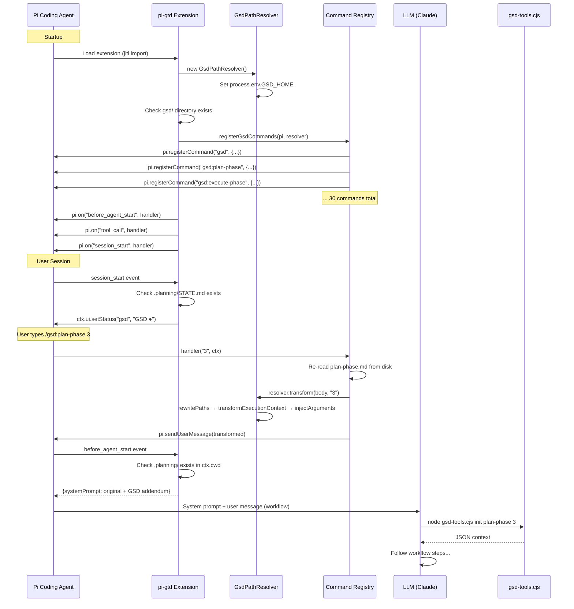

# Integration with Pi Coding Agent

> **Key Takeaways:**
> - pi-gtd plugs into Pi via the Extension API — 3 event hooks + command registration
> - The extension uses `pi.on()`, `pi.registerCommand()`, and `pi.sendUserMessage()`
> - Commands are delivered as user messages — the LLM then follows the workflow instructions
> - Pi loads the extension via `jiti` (TypeScript runs without compilation)
> - The integration contract is validated by `tests/compliance.test.ts`

## Integration Architecture



## Integration Points

### 1. Package Discovery

Pi discovers pi-gtd via `package.json`:

```json
{
  "name": "pi-gsd",
  "version": "0.1.0",
  "pi": {
    "extensions": ["extensions/gsd"],
    "agents": ["agents"]
  }
}
```

**Contract:**
- `pi.extensions` — array of paths to extension entry points (relative to package root)
- `pi.agents` — array of paths to agent definition directories
- Pi loads extensions via `jiti` — TypeScript runs without compilation
- Pi discovers agent `.md` files in the `agents/` directory for subagent spawning

**Source:** `package.json` (pi-gtd), Pi's extension loading in `packages/coding-agent/src/core/extensions/` (pi-mono)

### 2. Extension Factory Function

The extension entry point must export a default function that receives `ExtensionAPI`:

```typescript
// extensions/gsd/index.ts
import type { ExtensionAPI } from "@mariozechner/pi-coding-agent";

export default function (pi: ExtensionAPI) {
  // Extension initialization
}
```

**Contract:**
- Function is called once at Pi startup
- `pi: ExtensionAPI` provides `on()`, `registerCommand()`, `sendUserMessage()`
- The function must not throw — extension errors are logged but don't crash Pi
- If critical resources are missing, write to stderr and `return` (graceful degradation)

**Evidence:** `extensions/gsd/index.ts` lines 20-30 — checks for `gsd/` directory and `gsd/bin/gsd-tools.cjs` before proceeding.

### 3. Event Subscriptions

pi-gtd subscribes to 3 Pi lifecycle events:

#### `before_agent_start`

**When:** After user submits a prompt, before the LLM agent loop begins.

**What pi-gtd does:** If `.planning/` directory exists in `ctx.cwd`, injects a GSD-specific system prompt addendum containing:
- File locations (GSD_HOME, workflows, templates, etc.)
- Path resolution rules (legacy path → actual path mapping)
- Tool name mapping (Claude Code tool names → Pi tool names)
- gsd-tools usage instructions
- Subagent spawning instructions

```typescript
pi.on("before_agent_start", async (event: any, ctx: any) => {
  if (!fileExistsSync(path.join(ctx.cwd, ".planning"))) return;
  const gsdPrompt = buildGsdSystemPromptAddendum(resolver);
  return { systemPrompt: event.systemPrompt + gsdPrompt };
});
```

**Return contract:** `{ systemPrompt: string }` to modify the system prompt. Returning nothing means no modification.

**Source:** `extensions/gsd/index.ts:buildGsdSystemPromptAddendum()`

#### `tool_call`

**When:** Before any tool executes.

**What pi-gtd does:** If a `bash` command references `GSD_HOME` or `gsd-tools`, prepends `export GSD_HOME="{gsdHome}"` to ensure the environment variable is set.

```typescript
pi.on("tool_call", async (event: any) => {
  if (event.toolName !== "bash") return;
  const cmd = event.input?.command;
  if (!cmd) return;
  if (cmd.includes("GSD_HOME") || cmd.includes("gsd-tools")) {
    if (!cmd.includes("export GSD_HOME=")) {
      event.input.command = `export GSD_HOME="${resolver.gsdHome}"\n${cmd}`;
    }
  }
});
```

**Return contract:** Modifying `event.input.command` in-place. No return value needed for modification (vs returning `{ block: true }` to block).

**Source:** `extensions/gsd/index.ts` lines 47-58

#### `session_start`

**When:** On initial session load.

**What pi-gtd does:** If `.planning/STATE.md` exists, sets a status indicator in the Pi footer.

```typescript
pi.on("session_start", async (_event: any, ctx: any) => {
  if (fileExistsSync(path.join(ctx.cwd, ".planning", "STATE.md"))) {
    ctx.ui.setStatus("gsd", "GSD ●");
  }
});
```

**Source:** `extensions/gsd/index.ts` lines 60-64

### 4. Command Registration

pi-gtd registers 31 commands (30 `/gsd:*` commands + bare `/gsd`):

```typescript
pi.registerCommand("gsd:plan-phase", {
  description: "Create detailed phase plan (PLAN.md) with verification loop",
  handler: async (args: string, ctx: any) => {
    // Re-read .md file from disk (hot-reload support)
    const content = fs.readFileSync(filePath, "utf8");
    const { body } = parseCommand(content);
    const transformed = resolver.transform(body, args?.trim() ?? "");
    pi.sendUserMessage(transformed);
  },
});
```

**Contract:**
- `name` — command name without leading `/`
- `description` — shown in autocomplete
- `handler(args, ctx)` — `args` is everything after the command name; `ctx` is `ExtensionCommandContext`

**Key behavior:** Commands send the transformed workflow content as a **user message** via `pi.sendUserMessage()`. This triggers the LLM to read the workflow instructions and follow them. The command handler does NOT execute the workflow itself.

**Source:** `extensions/gsd/commands.ts:registerGsdCommands()`

### 5. User Message Delivery

```typescript
pi.sendUserMessage(transformedContent);
```

The transformed content includes:
- `<objective>` — what the command should achieve
- `<execution_context>` — files to read before proceeding (converted from `@path` references)
- `<process>` — step-by-step instructions for the LLM
- `$ARGUMENTS` replaced with user input

**Contract:**
- `pi.sendUserMessage(content)` sends an actual user message
- Always triggers a new LLM turn
- Content is treated as if typed by the user

### 6. Agent Definitions

Agents are registered via `package.json`:

```json
{
  "pi": {
    "agents": ["agents"]
  }
}
```

Pi discovers `agents/*.md` files and makes them available for subagent spawning. Agent files have YAML frontmatter:

```yaml
---
name: gsd-planner
description: Creates executable phase plans
tools: Read, Write, Bash, Glob, Grep, WebFetch
color: green
---
```

**Contract:**
- Agents are spawned by workflows via `Task(subagent_type="gsd-planner", ...)`
- In Pi, this maps to the `subagent` tool with `agent: "gsd-planner"`
- Each agent runs in its own context — no shared memory with orchestrator
- Agents communicate via file artifacts (write to `.planning/`, orchestrator reads)

## Environment Variables

| Variable | Set By | Used By | Purpose |
|----------|--------|---------|---------|
| `GSD_HOME` | `GsdPathResolver` constructor | `gsd-tools.cjs`, bash commands | Path to `gsd/` directory |
| `BRAVE_API_KEY` | User (optional) | `gsd-tools.cjs websearch` | Brave Search API authentication |

`GSD_HOME` is set in `process.env` by the extension at load time. It's also prepended to bash commands via the `tool_call` event handler.

## Versioning & Backward Compatibility

**No formal versioning contract exists between pi-gtd and pi-coding-agent.**

Evidence:
- `package.json` does not list `@mariozechner/pi-coding-agent` as a dependency — it's provided by the Pi runtime at load time
- No version pinning or compatibility checks in the extension code
- The compliance test suite (`tests/compliance.test.ts`) validates the extension API contract empirically

**Breakage risks:**
- Pi changing event names (`before_agent_start`, `tool_call`, `session_start`)
- Pi changing `registerCommand` handler signature
- Pi changing `sendUserMessage` behavior
- Pi changing how `package.json` `"pi"` field is interpreted
- Pi changing how agent `.md` files are discovered

**Mitigation:** `compliance.test.ts` tests (CMPL-01 through CMPL-07) verify the extension meets Pi's expected contract. Run after Pi SDK updates.

## Pi APIs Used by pi-gtd

| API | Where Used | Purpose |
|-----|-----------|---------|
| `pi.on(event, handler)` | `index.ts` | Subscribe to 3 lifecycle events |
| `pi.registerCommand(name, opts)` | `commands.ts` | Register 31 slash commands |
| `pi.sendUserMessage(content)` | `commands.ts` | Deliver workflow instructions to LLM |
| `ctx.ui.setStatus(id, text)` | `index.ts` | Show "GSD ●" in footer |
| `ctx.ui.notify(msg, level)` | `commands.ts` | Error notifications |
| `ctx.cwd` | `index.ts` | Current working directory |

**Not used:** `pi.registerTool()`, `pi.sendMessage()`, `pi.appendEntry()`, `pi.registerShortcut()`, `pi.registerFlag()`, `pi.exec()`, `pi.setActiveTools()`, `ctx.ui.select()`, `ctx.ui.confirm()`, `ctx.ui.custom()`.

pi-gtd intentionally keeps a minimal API surface. User interaction (questions, confirmations) happens through the LLM's natural conversation, not through Pi's UI APIs.

## End-to-End Integration Walkthrough

**Scenario:** Developer runs `/gsd:plan-phase 3`

1. **Pi runtime** matches the command to `gsd:plan-phase` handler
2. **Command handler** (`commands.ts`) reads `commands/gsd/plan-phase.md` from disk
3. **Frontmatter** is stripped; body contains `<execution_context>` and `<process>`
4. **Path resolver** rewrites `@~/.claude/get-shit-done/workflows/plan-phase.md` → `@{gsdHome}/workflows/plan-phase.md`
5. **Execution context transform** converts `@{gsdHome}/workflows/plan-phase.md` → "Read this file using the Read tool"
6. **Argument injection** replaces `$ARGUMENTS` with `"3"`
7. **`sendUserMessage()`** delivers the transformed content to the LLM
8. **`before_agent_start`** fires — GSD system prompt addendum is injected
9. **LLM reads** the workflow instructions and the execution context files
10. **LLM calls** `node gsd-tools.cjs init plan-phase 3` to get context
11. **LLM follows** the workflow: research → plan → verify → commit
12. **LLM spawns** subagents (gsd-planner, gsd-plan-checker) as needed
13. **Artifacts** are written to `.planning/phases/03-*/` and committed to git
