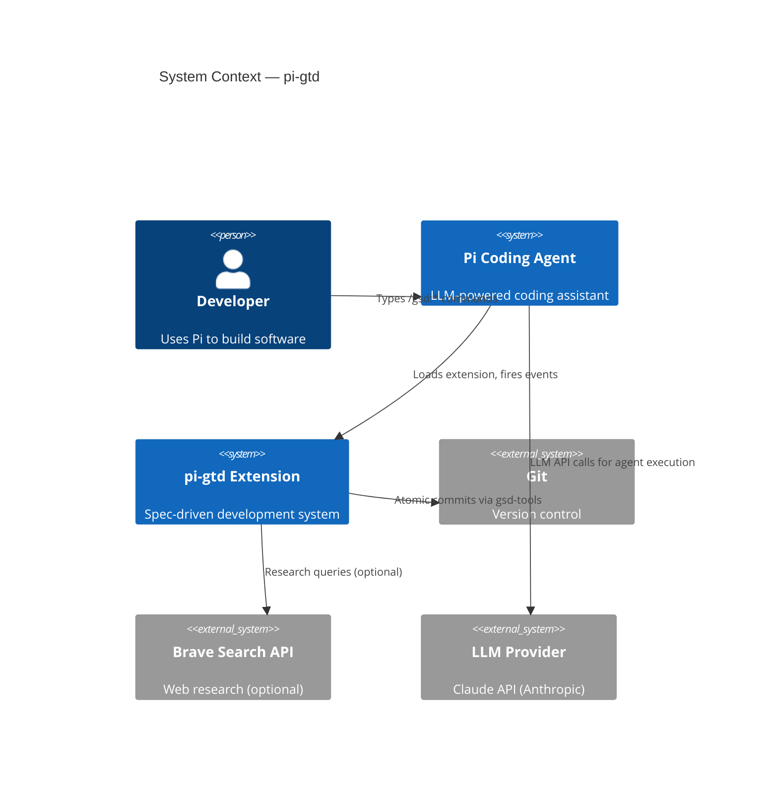
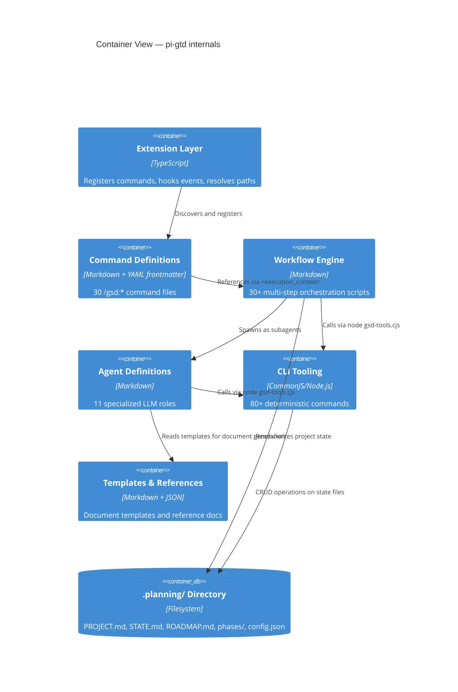

# Architecture Overview

> **Key Takeaways:**
> - pi-gtd is a Pi coding agent extension — it has no standalone runtime
> - All state lives in `.planning/` as markdown and JSON files — no database
> - The system has 6 layers: Extension → Commands → Workflows → Agents → CLI Tools → Templates
> - LLMs follow markdown instructions (workflows) and delegate deterministic ops to `gsd-tools.cjs`
> - The extension bridges two worlds: Pi's TypeScript API and GSD's markdown-as-code architecture

## System Purpose

pi-gtd gives an LLM a **structured methodology for building software**. Instead of the LLM freestyling an approach, pi-gtd provides:

1. **A lifecycle** — research → plan → execute → verify → repeat
2. **Persistent state** — project context survives across sessions via `.planning/` files
3. **Quality gates** — plan checking, verification, checkpoint protocols
4. **Parallel execution** — plans grouped into waves, executed by independent subagents
5. **Atomic commits** — every task produces a git commit, every plan produces a summary

**Constraint:** pi-gtd runs _inside_ the Pi coding agent. It cannot execute independently. It's an extension that registers commands, hooks lifecycle events, and injects context.

## C4 Context View



**Actors:**
- **Developer** — types `/gsd:new-project`, `/gsd:plan-phase 1`, etc.
- **Pi Coding Agent** — the host runtime that loads pi-gtd as an extension
- **LLM Provider** — Claude (Anthropic) provides the reasoning engine

**External Systems:**
- **Git** — version control; gsd-tools shells out to `git` for commits, branch ops
- **Brave Search** — optional web research for domain exploration

## C4 Container View



## Layer Architecture

pi-gtd has 6 distinct layers, each with a specific role:

```
┌─────────────────────────────────────────────────────────┐
│  Layer 1: Pi Extension (TypeScript)                      │
│  extensions/gsd/{index,commands,path-resolver}.ts        │
│  → Registers commands, hooks events, resolves paths      │
├─────────────────────────────────────────────────────────┤
│  Layer 2: Command Definitions (Markdown)                 │
│  commands/gsd/*.md                                       │
│  → User-facing /gsd:* slash commands with frontmatter    │
├─────────────────────────────────────────────────────────┤
│  Layer 3: Workflow Engine (Markdown)                     │
│  gsd/workflows/*.md                                      │
│  → Multi-step orchestration logic the LLM follows        │
├─────────────────────────────────────────────────────────┤
│  Layer 4: Agent Definitions (Markdown)                   │
│  agents/*.md                                             │
│  → Specialized LLM agent roles (planner, executor, etc.) │
├─────────────────────────────────────────────────────────┤
│  Layer 5: CLI Tooling (CommonJS)                         │
│  gsd/bin/gsd-tools.cjs + gsd/bin/lib/*.cjs               │
│  → Deterministic operations (file I/O, git, config)      │
├─────────────────────────────────────────────────────────┤
│  Layer 6: Templates & References (Markdown/JSON)         │
│  gsd/templates/ + gsd/references/                        │
│  → Document templates and reference documentation        │
└─────────────────────────────────────────────────────────┘
```

### Layer Interaction Rules

- **Layers 1-2** are TypeScript/code — they run deterministically at Pi startup
- **Layers 3-4** are markdown-as-code — they're read by the LLM and followed as instructions
- **Layer 5** is code called _from within_ LLM-executed workflows (via `node gsd-tools.cjs`)
- **Layer 6** is passive — read by agents/workflows when generating documents

**Key invariant:** The LLM never modifies layers 1-6. It only reads them (via the extension's path resolver) and writes to `.planning/` (the state directory).

## Major Subsystems

### 1. Path Resolution Subsystem
**Owner:** `extensions/gsd/path-resolver.ts`

Bridges GSD's canonical paths (from its Claude Code origins) to the actual installed location. Applies a 3-stage transform pipeline:
1. **Rewrite paths** — 4 regex rules convert legacy paths to `gsdHome`
2. **Transform `<execution_context>`** — converts `@path` lines to "Read this file" instructions
3. **Inject arguments** — replaces `$ARGUMENTS` with user input

### 2. Command Registration Subsystem
**Owner:** `extensions/gsd/commands.ts`

Discovers `commands/gsd/*.md` files, parses YAML frontmatter for metadata, and registers each as a Pi slash command. Command handlers re-read the `.md` file at invocation time (supporting hot-reload via `/reload`).

### 3. Workflow Orchestration Subsystem
**Owner:** `gsd/workflows/*.md` (read by the LLM)

The LLM reads workflow files and follows them step-by-step. Workflows coordinate: calling `gsd-tools.cjs` for deterministic ops, spawning subagents for specialized work, presenting results to the user, managing state transitions.

### 4. Agent Execution Subsystem
**Owner:** `agents/*.md` (spawned as subagents)

Specialized LLM roles (planner, executor, verifier, etc.) that receive focused prompts and produce specific artifacts. Each agent has clear inputs (files to read) and outputs (files to write).

### 5. CLI Tooling Subsystem
**Owner:** `gsd/bin/gsd-tools.cjs` + `gsd/bin/lib/*.cjs`

80+ commands organized into 11 library modules. Handles all deterministic operations: config CRUD, state management, phase lifecycle, roadmap parsing, git commits, verification, template filling. Zero external dependencies — uses only Node.js built-ins.

### 6. State Management Subsystem
**Owner:** `.planning/` directory (managed by CLI tooling and agents)

All project state lives as files. No database, no in-memory state that survives across sessions. Key files: `PROJECT.md`, `ROADMAP.md`, `REQUIREMENTS.md`, `STATE.md`, `config.json`, plus per-phase directories with `PLAN.md`, `SUMMARY.md`, etc.

## Design Principles

1. **Markdown as code** — Workflows and agents are markdown files that become LLM prompts. This means non-engineers can read and modify the system's behavior.

2. **File-based state machine** — `.planning/` IS the project state. No process memory, no database. This enables context recovery across sessions.

3. **Deterministic/non-deterministic split** — LLMs handle reasoning (planning, coding, verification). `gsd-tools.cjs` handles everything else (file I/O, git, config). Clean separation.

4. **Fail-fast CLI** — `gsd-tools.cjs` commands either succeed and output JSON or fail with `process.exit(1)`. No retry logic, no partial results.

5. **Atomic commits** — Every meaningful unit of work produces a git commit. If context is lost mid-execution, artifacts persist in git.

6. **Extension portability** — Path resolver handles the translation from GSD's original Claude Code paths to any installation location. The 30+ workflow files don't need to know where they're installed.

## Glossary

| Term | Definition |
|------|-----------|
| **Extension** | A Pi coding agent plugin — TypeScript module loaded at startup |
| **Orchestrator** | The top-level LLM following a workflow `.md` — coordinates subagents |
| **Subagent** | A spawned LLM instance with a focused role (e.g., gsd-planner) |
| **Phase** | A unit of work in the roadmap, containing one or more plans |
| **Plan** | A `PLAN.md` file — an executable prompt for gsd-executor |
| **Wave** | A parallelization group — plans in wave 1 run before wave 2 |
| **Summary** | A `SUMMARY.md` file — post-execution report of what was done |
| **Verification** | Goal-backward check that a phase achieved its objective |
| **gsd-tools** | The CLI binary (`gsd-tools.cjs`) for deterministic operations |
| **Init command** | A compound `gsd-tools init X` call that assembles all context for a workflow |
| **Path resolver** | `GsdPathResolver` — translates canonical paths to actual install paths |
| **Model profile** | Quality/balanced/budget — controls which LLM model each agent uses |
| **Frontmatter** | YAML metadata block (`---\n...\n---`) at the top of markdown files |
| **`.planning/`** | Project state directory — all GSD artifacts live here |
| **YOLO mode** | Auto-approve workflow gates — skip confirmations |
| **Interactive mode** | Confirm at each workflow gate — pause for user input |
