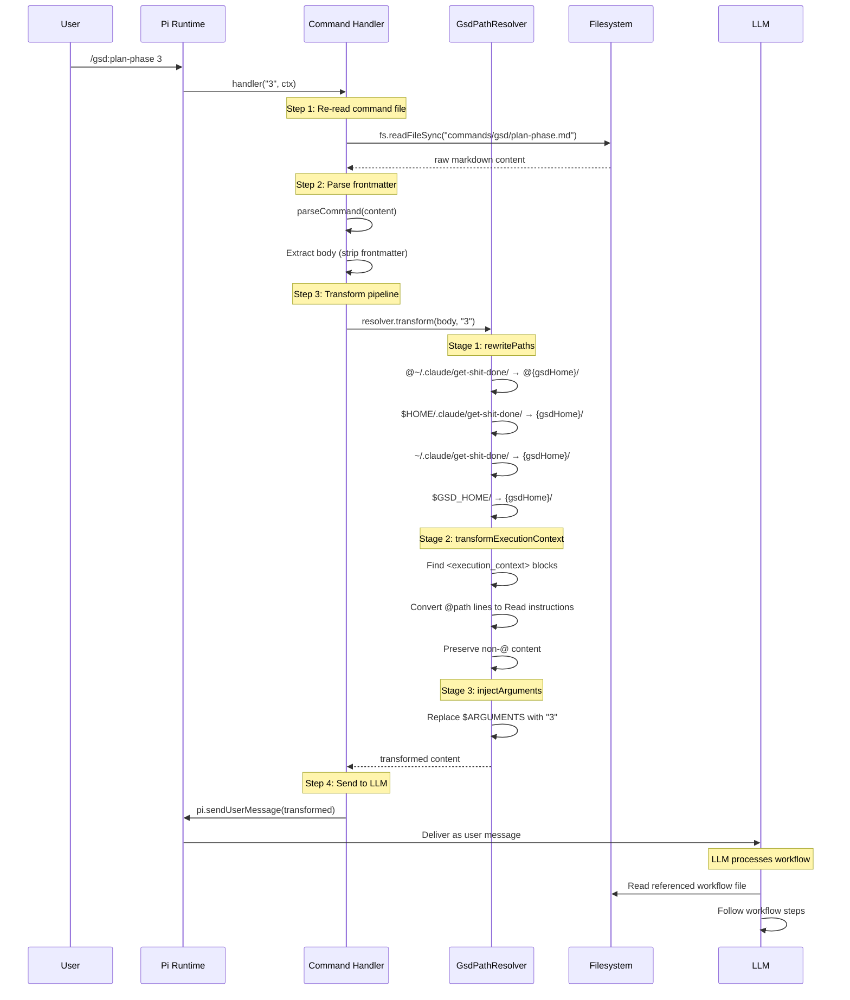

# Flow: Command Invocation

> **Key Takeaways:**
> - `/gsd:X` commands don't execute workflows directly — they send transformed markdown to the LLM as a user message
> - The transform pipeline has 3 stages: path rewrite → execution context → argument injection
> - Command bodies are re-read from disk on every invocation (hot-reload via `/reload`)
> - The LLM receives instructions, reads referenced files, then follows the workflow

## Trigger

User types a GSD command, e.g., `/gsd:plan-phase 3`

## Sequence Diagram



## Transform Pipeline Detail

### Input (raw `plan-phase.md` body)

```xml
<objective>
Create executable phase prompts (PLAN.md files)...
</objective>

<execution_context>
@~/.claude/get-shit-done/workflows/plan-phase.md
@~/.claude/get-shit-done/references/ui-brand.md
</execution_context>

<context>
Phase number: $ARGUMENTS
</context>
```

### After Stage 1: `rewritePaths()`

```xml
<execution_context>
@/home/mia/dev/pi-gtd/gsd/workflows/plan-phase.md
@/home/mia/dev/pi-gtd/gsd/references/ui-brand.md
</execution_context>

<context>
Phase number: $ARGUMENTS
</context>
```

### After Stage 2: `transformExecutionContext()`

```xml
<execution_context>
IMPORTANT: Read each of these files using the Read tool before proceeding:
- /home/mia/dev/pi-gtd/gsd/workflows/plan-phase.md
- /home/mia/dev/pi-gtd/gsd/references/ui-brand.md
</execution_context>

<context>
Phase number: $ARGUMENTS
</context>
```

### After Stage 3: `injectArguments("3")`

```xml
<execution_context>
IMPORTANT: Read each of these files using the Read tool before proceeding:
- /home/mia/dev/pi-gtd/gsd/workflows/plan-phase.md
- /home/mia/dev/pi-gtd/gsd/references/ui-brand.md
</execution_context>

<context>
Phase number: 3
</context>
```

## Error Handling

| Condition | Behavior | Evidence |
|-----------|----------|----------|
| `.md` file unreadable at invocation | `ctx.ui.notify("Failed to read command file", "error")` | `commands.ts` handler try/catch |
| Empty body after parsing | `ctx.ui.notify("Command file has no content", "error")` | `commands.ts` handler check |
| Invalid arguments | Passed through to LLM — workflow handles validation | `injectArguments` is simple string replacement |

## Hot-Reload Support

Commands re-read their `.md` file on every invocation:

```typescript
handler: async (args: string, ctx: any) => {
  // Re-read at invocation time so edits take effect without restart
  let content: string;
  try {
    content = fs.readFileSync(filePath, "utf8");
  } catch { ... }
  ...
}
```

This means you can edit `commands/gsd/plan-phase.md`, run `/reload` in Pi, and the next `/gsd:plan-phase` call uses the updated content.

**Evidence:** `extensions/gsd/commands.ts` handler function, lines 72-80.
