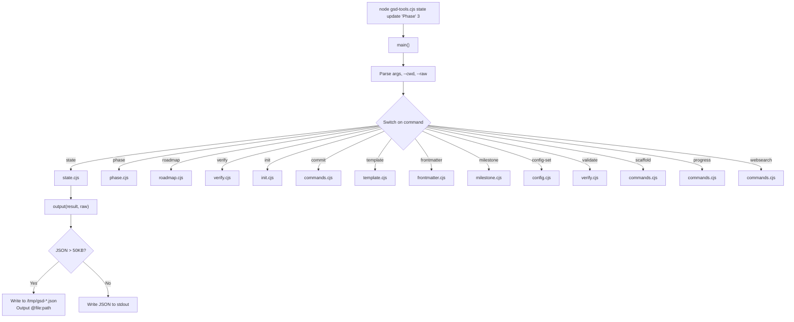

# Flow: gsd-tools CLI

> **Key Takeaways:**
> - `gsd-tools.cjs` is a single-file CLI router dispatching to 11 library modules
> - 80+ commands organized hierarchically: `state`, `phase`, `roadmap`, `verify`, `init`, etc.
> - All output is JSON to stdout (or `@file:/tmp/...` for large payloads)
> - Errors go to stderr + `process.exit(1)`
> - Zero external dependencies — Node.js built-ins only

## Dispatch Flow



## Command Categories

### Init Commands (Compound)
**Purpose:** Assemble all context a workflow needs in one call.

```bash
# Returns JSON with models, phase info, config flags, file paths
gsd-tools init execute-phase 3
gsd-tools init plan-phase 5
gsd-tools init new-project
gsd-tools init quick "fix the login bug"
gsd-tools init resume
```

**Why compound?** Each workflow needs 5-15 pieces of context (models, config, phase info, file existence). Without init commands, the LLM would need 5-15 separate bash calls. Init commands reduce this to 1 call.

**Source:** `gsd/bin/lib/init.cjs`

### State Commands
```bash
gsd-tools state load              # Full config + state
gsd-tools state json              # STATE.md frontmatter as JSON
gsd-tools state update "Phase" 3  # Update a field
gsd-tools state get [section]     # Read a field or section
gsd-tools state patch --field val # Batch update
gsd-tools state advance-plan      # Increment plan counter
gsd-tools state record-metric ... # Record execution metrics
gsd-tools state update-progress   # Recalculate progress bar
gsd-tools state add-decision ...  # Append decision
gsd-tools state add-blocker ...   # Add blocker
gsd-tools state resolve-blocker . # Remove blocker
gsd-tools state record-session .. # Update session continuity
```

### Phase Commands
```bash
gsd-tools find-phase 3            # Find phase directory
gsd-tools phase add "description" # Append new phase to roadmap
gsd-tools phase insert 7 "desc"   # Insert decimal phase (7.1)
gsd-tools phase remove 17         # Remove phase, renumber
gsd-tools phase complete 3        # Mark phase done
gsd-tools phase next-decimal 7    # Calculate next decimal (7.1)
gsd-tools phase-plan-index 3      # Index plans with waves
gsd-tools phases list              # List all phase directories
```

### Roadmap Commands
```bash
gsd-tools roadmap get-phase 3     # Extract phase section
gsd-tools roadmap analyze         # Full roadmap parse
gsd-tools roadmap update-plan-progress 3  # Update progress table
```

### Verification Commands
```bash
gsd-tools verify-summary path     # Check SUMMARY.md quality
gsd-tools verify plan-structure f # Check PLAN.md structure
gsd-tools verify phase-completeness 3  # All plans have summaries?
gsd-tools verify references file  # Check @-refs resolve
gsd-tools verify commits h1 h2    # Verify commit hashes
gsd-tools verify artifacts plan   # Check must_haves.artifacts
gsd-tools verify key-links plan   # Check must_haves.key_links
gsd-tools validate consistency    # Phase numbering + disk sync
gsd-tools validate health [--repair]  # .planning/ integrity
```

### Utility Commands
```bash
gsd-tools commit "message" --files f1 f2   # Git commit
gsd-tools generate-slug "Hello World"       # → "hello-world"
gsd-tools current-timestamp [full|date|filename]
gsd-tools list-todos [area]
gsd-tools verify-path-exists path
gsd-tools config-ensure-section
gsd-tools config-set key.path value
gsd-tools config-get key.path
gsd-tools history-digest
gsd-tools summary-extract path [--fields]
gsd-tools websearch "query" [--limit N]
gsd-tools progress [json|table|bar]
```

## Output Protocol

### JSON Mode (default)
```json
{
  "phase_found": true,
  "phase_dir": ".planning/phases/03-api",
  "plans": ["03-01-PLAN.md", "03-02-PLAN.md"]
}
```

### Raw Mode (`--raw`)
Single value output for shell scripting:
```
.planning/phases/03-api
```

### Large Payload Mode (>50KB)
```
@file:/tmp/gsd-1709654321000.json
```

The caller detects the `@file:` prefix and reads from the temp file.

**Source:** `gsd/bin/lib/core.cjs:output()`

## Error Protocol

All errors go to stderr + `process.exit(1)`:

```
Error: phase required for init execute-phase
```

No structured error JSON. No retry logic. Fail-fast.

**Source:** `gsd/bin/lib/core.cjs:error()`

## `--cwd` Override

Subagents may run in sandboxed environments outside the project root. The `--cwd` flag overrides the working directory:

```bash
gsd-tools --cwd /path/to/project state load
```

**Source:** `gsd-tools.cjs` lines 15-27
