# Flow: New Project Initialization

> **Key Takeaways:**
> - The longest flow in GSD: questioning → research → requirements → roadmap
> - 9 steps with multiple decision gates and subagent spawns
> - Auto mode (`--auto`) skips interactive questioning and approval gates
> - Creates 5+ artifacts in `.planning/` with atomic git commits after each stage

## Trigger

User runs `/gsd:new-project` (interactive) or `/gsd:new-project --auto @idea.md` (auto mode)

## Flow Diagram

```mermaid
flowchart TD
    A["/gsd:new-project"] --> B["Step 1: Setup<br/>gsd-tools init new-project"]
    B --> C{project_exists?}
    C -->|Yes| ERR["Error: Already initialized"]
    C -->|No| D{has_git?}
    D -->|No| GIT["git init"]
    D -->|Yes| E{needs_codebase_map?}
    GIT --> E
    E -->|Yes| F{"Offer codebase mapping"}
    E -->|No| G{Auto mode?}
    F -->|Map first| MAP["Run /gsd:map-codebase<br/>Exit"]
    F -->|Skip| G

    G -->|Auto| AC["Step 2a: Auto Config<br/>Collect depth, git, agents"]
    G -->|Interactive| H["Step 3: Deep Questioning<br/>Collaborative dream extraction"]

    AC --> I["Step 4: Write PROJECT.md"]
    H --> RDY{"Ready to create<br/>PROJECT.md?"}
    RDY -->|Keep exploring| H
    RDY -->|Create| I

    I --> J["git commit PROJECT.md"]
    J --> K{Auto mode?}
    K -->|Auto| L
    K -->|Interactive| PREFS["Step 5: Workflow Preferences<br/>Mode, depth, agents"]
    PREFS --> CC["git commit config.json"]
    CC --> L

    L["Step 6: Research Decision"]
    L --> M{Research?}
    M -->|Yes| N["Spawn 4 parallel researchers<br/>Stack / Features / Arch / Pitfalls"]
    M -->|Skip| P

    N --> O["Spawn synthesizer<br/>Create SUMMARY.md"]
    O --> P["Step 7: Define Requirements<br/>Scope v1 features by category"]

    P --> Q["git commit REQUIREMENTS.md"]
    Q --> R["Step 8: Create Roadmap<br/>Spawn gsd-roadmapper"]
    R --> S{Roadmap approved?}
    S -->|Adjust| R
    S -->|Approve| T["git commit ROADMAP.md + STATE.md"]

    T --> U["Step 9: Done<br/>Show summary + next steps"]
    U --> V{"Auto mode?"}
    V -->|Auto| W["Auto-advance to<br/>/gsd:discuss-phase 1"]
    V -->|Interactive| X["Show /gsd:plan-phase 1<br/>as next step"]
```

## Step-by-Step Narrative

### Step 1: Setup
**Call chain:** `gsd-tools.cjs init new-project` → `init.cjs:cmdInitNewProject()`

Returns JSON context: `researcher_model`, `synthesizer_model`, `roadmapper_model`, `project_exists`, `has_codebase_map`, `needs_codebase_map`, `has_existing_code`, `has_git`, etc.

**Gates:**
- `project_exists = true` → Error, already initialized
- `has_git = false` → `git init`

### Step 2: Brownfield Detection
If `needs_codebase_map = true` (existing code but no codebase map), offers to run `/gsd:map-codebase` first.

### Step 3: Deep Questioning (Interactive Only)
The LLM asks open-ended questions following `gsd/references/questioning.md` guidance:
- Start open ("What do you want to build?")
- Follow energy and threads
- Challenge vagueness
- Make abstract concrete

**Anti-patterns the LLM is instructed to avoid:** checklist walking, canned questions, corporate speak, interrogation, rushing, shallow acceptance.

### Step 4: Write PROJECT.md
Synthesizes all context into `.planning/PROJECT.md` using `gsd/templates/project.md`.

For brownfield projects: infers Validated requirements from existing codebase map.

### Step 5: Workflow Preferences (Interactive Only)
Two rounds of questions:
1. Core settings: mode (YOLO/interactive), depth, parallelization, git tracking
2. Workflow agents: research, plan check, verifier, model profile

Creates `.planning/config.json`.

### Step 6: Research
Spawns 4 parallel `gsd-project-researcher` agents:
- **Stack** → `.planning/research/STACK.md`
- **Features** → `.planning/research/FEATURES.md`
- **Architecture** → `.planning/research/ARCHITECTURE.md`
- **Pitfalls** → `.planning/research/PITFALLS.md`

Then spawns `gsd-research-synthesizer` → `.planning/research/SUMMARY.md`

### Step 7: Define Requirements
- If research exists: presents features by category, user selects v1/v2/out-of-scope
- If no research: gathers requirements through conversation
- Generates `REQUIREMENTS.md` with REQ-IDs

### Step 8: Create Roadmap
Spawns `gsd-roadmapper` agent which:
1. Derives phases from requirements
2. Maps every v1 requirement to exactly one phase
3. Derives success criteria per phase
4. Writes `ROADMAP.md`, `STATE.md`, updates `REQUIREMENTS.md` traceability

### Step 9: Completion
Shows summary table of all created artifacts and phase count.

## Artifacts Created

| Artifact | File | Committed |
|----------|------|-----------|
| Project context | `.planning/PROJECT.md` | ✓ |
| Config | `.planning/config.json` | ✓ |
| Stack research | `.planning/research/STACK.md` | ✓ (if research) |
| Features research | `.planning/research/FEATURES.md` | ✓ (if research) |
| Architecture research | `.planning/research/ARCHITECTURE.md` | ✓ (if research) |
| Pitfalls research | `.planning/research/PITFALLS.md` | ✓ (if research) |
| Research summary | `.planning/research/SUMMARY.md` | ✓ (if research) |
| Requirements | `.planning/REQUIREMENTS.md` | ✓ |
| Roadmap | `.planning/ROADMAP.md` | ✓ |
| Project state | `.planning/STATE.md` | ✓ |

## Error Cases

| Condition | Behavior |
|-----------|----------|
| Project already initialized | Error message, suggest `/gsd:progress` |
| Auto mode without document | Error with usage instructions |
| Roadmapper returns ROADMAP BLOCKED | Present blocker, work with user to resolve |
