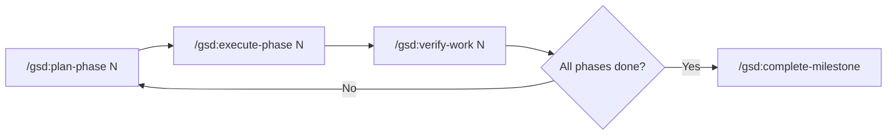
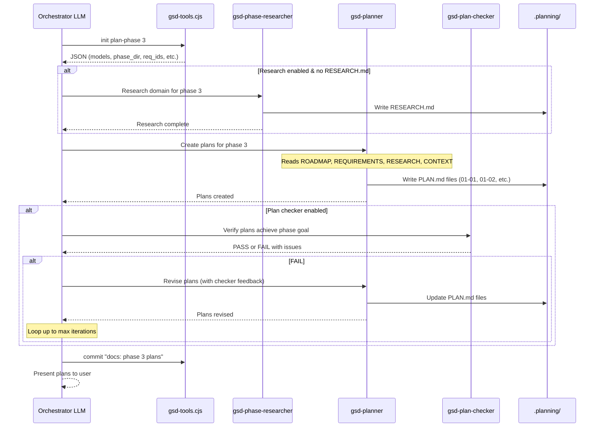
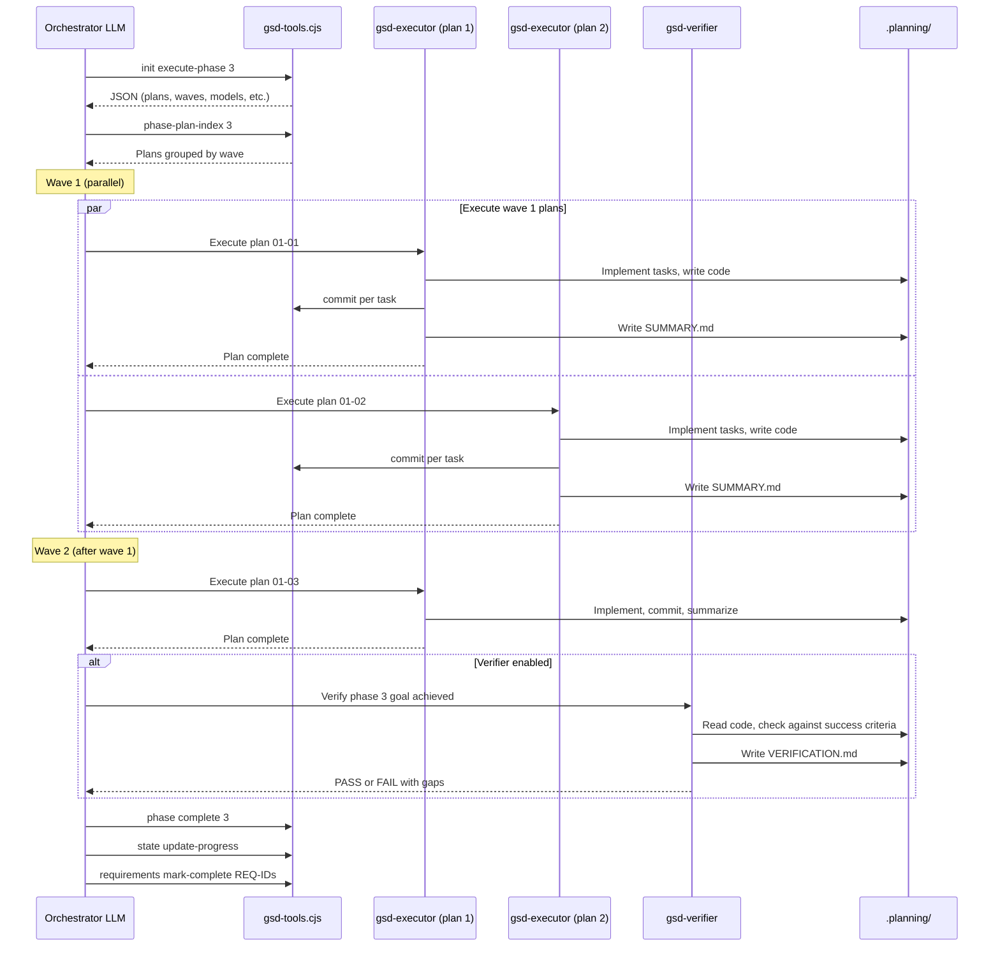
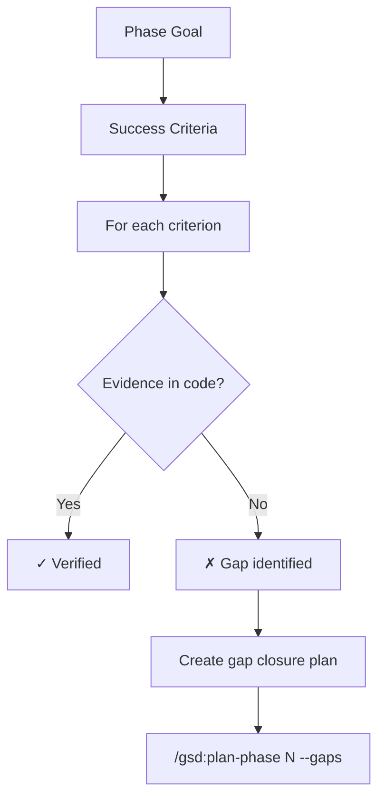

# Flow: Plan Phase → Execute Phase → Verify

> **Key Takeaways:**
> - Plan-phase: research → plan → plan-check verification loop (max iterations)
> - Execute-phase: discover plans → group into waves → parallel execution → verify
> - Plans within a wave can run in parallel; waves are sequential
> - Each executed plan produces a SUMMARY.md with commit hashes

## The Core Loop

## Plan Phase Flow

### Trigger
`/gsd:plan-phase 3` (or auto-detect next unplanned phase)

### Sequence

### Key Details

- **Phase auto-detection:** If no phase number given, finds the next phase with no plans
- **Research skip:** `--skip-research` flag or existing RESEARCH.md
- **CONTEXT.md:** If `/gsd:discuss-phase` was run first, CONTEXT.md contains user's vision — planner must honor locked decisions
- **Plan structure:** Each plan has frontmatter (`phase`, `plan`, `wave`, `depends_on`), objective, tasks, must-haves, success criteria
- **Wave assignment:** Planner groups plans into waves. Wave 1 runs first, wave 2 after wave 1 completes.
- **PRD express path:** `--prd path/to/file.md` bypasses discuss-phase, using the PRD as locked decisions

## Execute Phase Flow

### Trigger
`/gsd:execute-phase 3`

### Sequence

### Wave Execution Detail

1. **Discover plans:** `gsd-tools phase-plan-index 3` returns plans with wave assignments
2. **Filter:** Skip plans with existing SUMMARY.md (already complete)
3. **Group by wave:** Wave 1 plans first, then wave 2, etc.
4. **Execute wave:**
   - If `parallelization = true`: spawn all wave plans simultaneously
   - If `parallelization = false`: execute sequentially within wave
5. **Handle checkpoints:** Some plans have `autonomous: false` — these pause for user input
6. **Collect results:** Read each SUMMARY.md, verify commit hashes

### Executor Behavior

Each gsd-executor agent:
1. Reads the PLAN.md file
2. Reads project context (`CLAUDE.md`, skills)
3. Executes tasks in order
4. Creates an atomic git commit per task
5. Handles deviations (if implementation differs from plan)
6. Writes SUMMARY.md with commit hashes and file manifest
7. Updates STATE.md metrics

## Verify Work Flow

### Trigger
`/gsd:verify-work 3` (or auto-triggered after execute-phase)

### Approach: Goal-Backward Verification

The verifier does NOT check if tasks were completed. It checks if the **phase goal was achieved**.

**Key principle:** From `agents/gsd-verifier.md`: _"Task completion ≠ Goal achievement. A task 'create chat component' can be marked complete when the component is a placeholder."_

The verifier reads actual code, runs tests, and checks that observable user behavior matches success criteria.

## State Updates During Execution

| When | What Changes | How |
|------|-------------|-----|
| Plan execution starts | STATE.md current plan | `gsd-tools state update "Current Plan" 1` |
| Task committed | None (executor handles) | `gsd-tools commit "feat: ..."` |
| Plan completes | STATE.md metrics | `gsd-tools state record-metric --phase N --plan M` |
| All plans complete | STATE.md progress | `gsd-tools state update-progress` |
| Phase verified | ROADMAP.md checkbox | `gsd-tools phase complete N` |
| Requirements done | REQUIREMENTS.md checkboxes | `gsd-tools requirements mark-complete IDs` |
