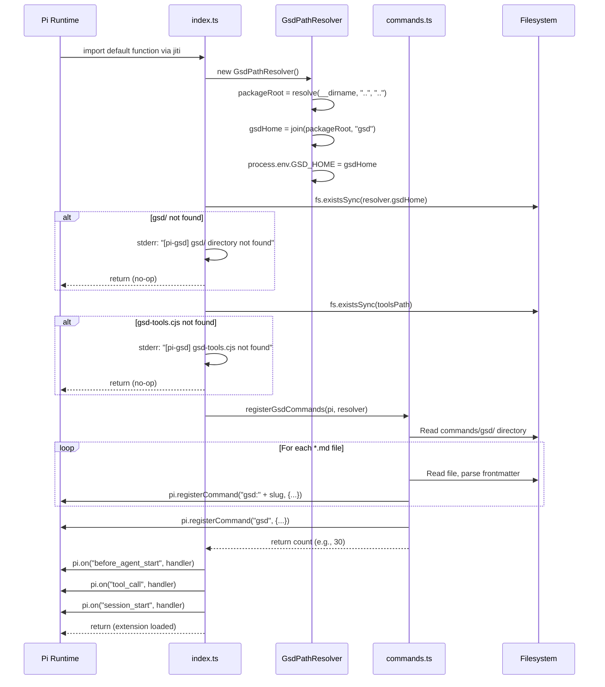

# Flow: Extension Startup

> **Key Takeaways:**
> - Extension loads synchronously at Pi startup — no async initialization
> - Graceful degradation: if `gsd/` or `gsd-tools.cjs` is missing, extension silently returns
> - 3 event handlers are registered but only fire when `.planning/` exists
> - Command registration discovers all `commands/gsd/*.md` files at load time

## Trigger

Pi starts and loads installed extension packages. pi-gtd is discovered via `package.json`:

```json
{ "pi": { "extensions": ["extensions/gsd"], "agents": ["agents"] } }
```

## Sequence Diagram



## Call Chain

1. `extensions/gsd/index.ts:default(pi)` — entry point
2. `extensions/gsd/path-resolver.ts:GsdPathResolver()` — constructor sets `packageRoot`, `gsdHome`, `GSD_HOME`
3. `fs.existsSync(resolver.gsdHome)` — graceful degradation check
4. `fs.existsSync(toolsPath)` — graceful degradation check
5. `extensions/gsd/commands.ts:registerGsdCommands(pi, resolver)` — command discovery
   - `fs.readdirSync(commandsDir)` — find `*.md` files
   - `parseCommand(content)` — extract frontmatter (name, description, argument-hint)
   - `pi.registerCommand(cmdName, { description, handler })` — register each command
6. `pi.on("before_agent_start", ...)` — system prompt injection
7. `pi.on("tool_call", ...)` — GSD_HOME env var injection
8. `pi.on("session_start", ...)` — status indicator

## Error Handling

| Condition | Behavior | Evidence |
|-----------|----------|----------|
| `gsd/` directory missing | stderr message, `return` (no commands registered) | `index.ts` lines 22-25 |
| `gsd-tools.cjs` missing | stderr message, `return` (no commands registered) | `index.ts` lines 28-31 |
| Command `.md` file unreadable | Skip that command, continue registration | `commands.ts` `try/catch` in loop |
| `commands/gsd/` directory missing | Return 0 (no commands) | `commands.ts` `fs.existsSync(commandsDir)` |

**No retry logic.** If resources are missing at startup, they stay missing until Pi is restarted.

## Performance Notes

- Startup is synchronous — all `fs.*Sync` calls
- Command descriptions are read once at registration (used for autocomplete)
- Command bodies are re-read at invocation time (supports hot-reload)
- Event handlers are lightweight — they check `.planning/` existence before doing any work
