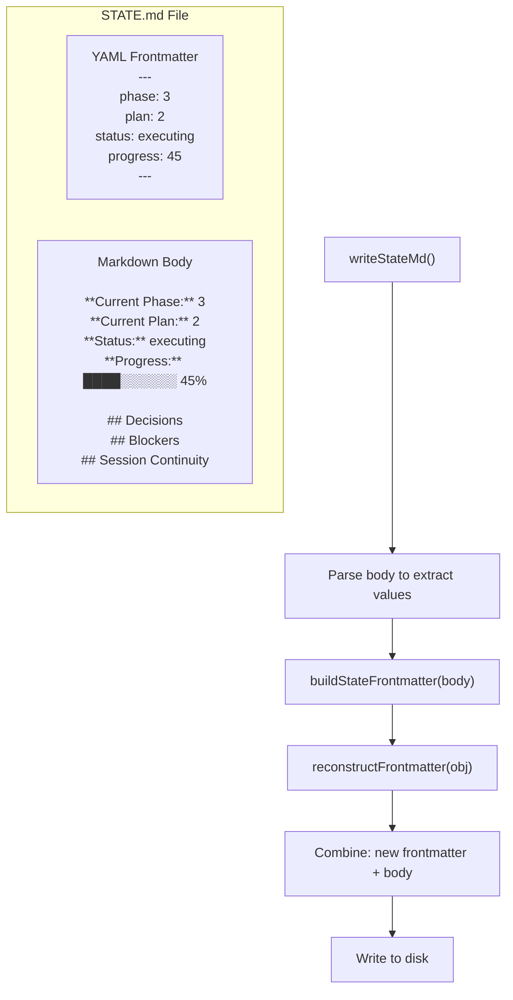
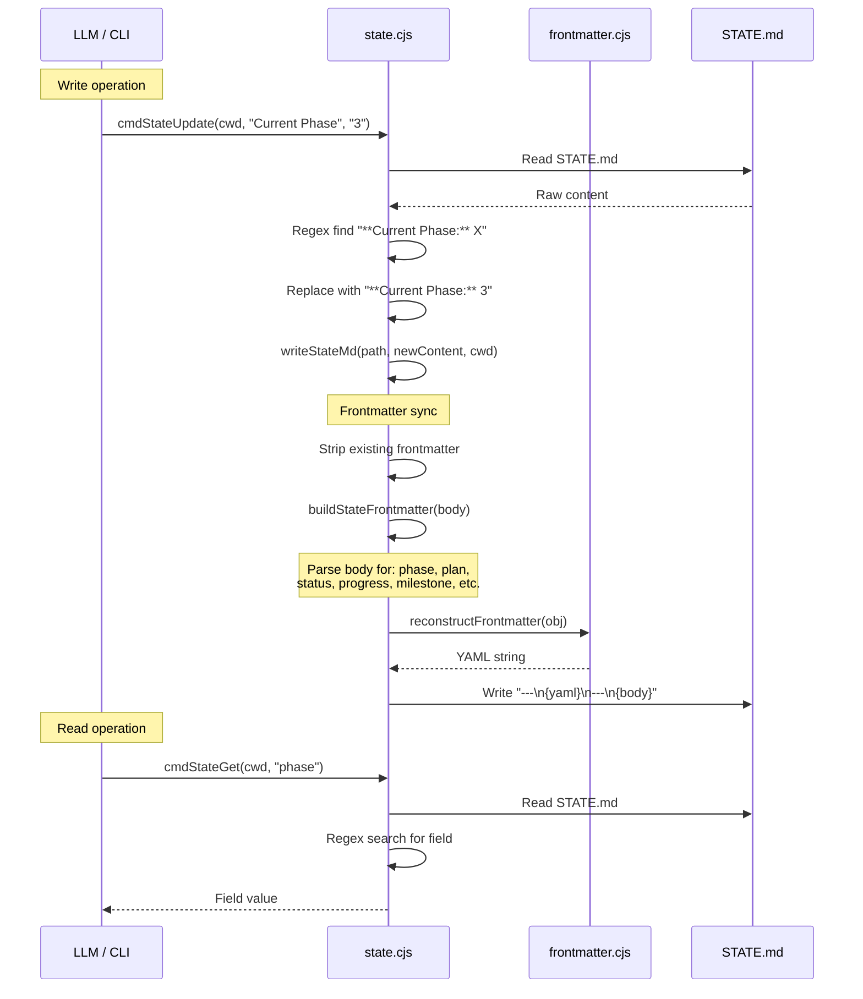

# Flow: State Management

> **Key Takeaways:**
> - STATE.md is the project's living memory — survives across sessions
> - Dual representation: YAML frontmatter (machine) + markdown body (human), synced on every write
> - `writeStateMd()` is the single write gateway — always call it, never write STATE.md directly
> - State progression: `advance-plan`, `record-metric`, `update-progress`, `add-decision`, `add-blocker`

## STATE.md Architecture



## Read/Write Cycle



## State Progression Commands

### `state advance-plan`
Increments the current plan number in STATE.md. Called by the execute-phase orchestrator between plans.

### `state record-metric`
Records execution metrics for a completed plan:
```bash
gsd-tools state record-metric --phase 3 --plan 2 --duration 15min --tasks 5 --files 8
```

### `state update-progress`
Recalculates the progress bar from phase/plan completion data. Scans `.planning/phases/` to count completed vs total plans.

### `state add-decision`
Appends a decision to the Decisions table:
```bash
gsd-tools state add-decision --summary "Use SQLite" --phase 1 --rationale "Simplicity"
```

### `state add-blocker` / `state resolve-blocker`
Manages the Blockers list in STATE.md.

### `state record-session`
Records session continuity information (where work stopped, resume file path).

## `writeStateMd()` — The Write Gateway

**Every write to STATE.md MUST go through `writeStateMd()`.**

Source: `gsd/bin/lib/state.cjs`

This function:
1. Strips existing frontmatter from content
2. Calls `buildStateFrontmatter(body)` to extract field values from the markdown body
3. Calls `reconstructFrontmatter(obj)` to build YAML
4. Writes `---\n{yaml}\n---\n{body}` to disk

**Why:** The frontmatter is a machine-readable cache of values in the body. If you write the body without rebuilding frontmatter, the two go out of sync. Downstream tools that read frontmatter (like `state-snapshot`) will return stale data.

## Field Extraction Patterns

`buildStateFrontmatter()` extracts values from the body using these patterns:

| Field | Pattern | Example |
|-------|---------|---------|
| `phase` | `**Current Phase:** X` | `**Current Phase:** 3` |
| `plan` | `**Current Plan:** X` | `**Current Plan:** 2` |
| `status` | `**Status:** X` | `**Status:** executing` |
| `progress` | `**Progress:**` line, extract percentage | `**Progress:** ████░░░░░░ 45%` |
| `milestone` | `**Milestone:** X` | `**Milestone:** v1.0` |

**Fragility note:** If someone changes the body format (e.g., `**Phase:**` instead of `**Current Phase:**`), frontmatter sync breaks silently. The regex patterns are in `buildStateFrontmatter()` in `state.cjs`.
