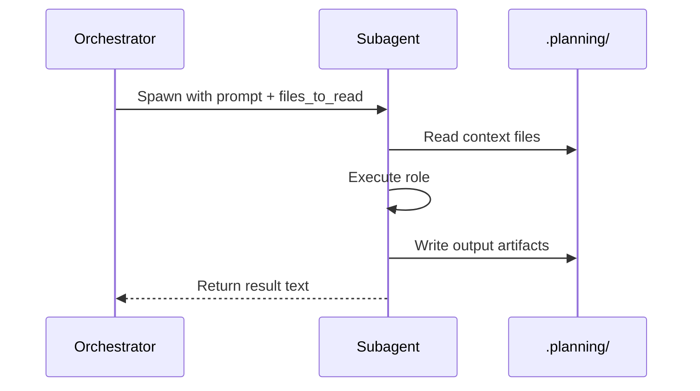

# Module: Agent Definitions (`agents/`)

> **Purpose:** Specialized LLM roles spawned as subagents by workflow orchestrators.
> **Format:** Markdown with YAML frontmatter
> **Count:** 11 agent files

## Agent Catalog

| Agent | Color | Model (balanced) | Spawned By | Output |
|-------|-------|------------------|-----------|--------|
| `gsd-planner` | green | opus | `plan-phase` | PLAN.md files |
| `gsd-executor` | yellow | sonnet | `execute-phase` | Code + SUMMARY.md |
| `gsd-verifier` | green | sonnet | `verify-work` | VERIFICATION.md |
| `gsd-debugger` | — | sonnet | `debug` | Debug session files |
| `gsd-roadmapper` | — | sonnet | `new-project` | ROADMAP.md + STATE.md |
| `gsd-phase-researcher` | — | sonnet | `plan-phase` | RESEARCH.md |
| `gsd-project-researcher` | — | sonnet | `new-project` | Stack/Features/Arch/Pitfalls.md |
| `gsd-research-synthesizer` | — | sonnet | `new-project` | SUMMARY.md |
| `gsd-plan-checker` | — | sonnet | `plan-phase` | Pass/fail verdict |
| `gsd-codebase-mapper` | — | haiku | `map-codebase` | Codebase docs (7 files) |
| `gsd-integration-checker` | — | sonnet | `audit-milestone` | Integration report |

## Agent File Structure

```yaml
---
name: gsd-executor
description: Executes GSD plans with atomic commits...
tools: Read, Write, Edit, Bash, Grep, Glob
color: yellow
---

<role>
You are a GSD plan executor. Your job: ...
</role>

<project_context>
Read CLAUDE.md and project skills before executing.
</project_context>

<execution_flow>
<step name="load_project_state" priority="first">
Load context via gsd-tools init...
</step>

<step name="execute_tasks">
For each task in the plan...
</step>
</execution_flow>
```

### Frontmatter Fields

| Field | Purpose |
|-------|---------|
| `name` | Agent identifier (matches subagent_type in Task calls) |
| `description` | Agent role description |
| `tools` | Comma-separated list of tools the agent can use |
| `color` | TUI color for agent output |

## Agent Interaction Model



**Key:** Agents communicate via **file artifacts**, not return values. The orchestrator reads the files the agent wrote.

## Agent Deep Dives

### gsd-planner
**Input:** ROADMAP phase section, REQUIREMENTS, RESEARCH, CONTEXT.md
**Output:** PLAN.md files with frontmatter, tasks, must-haves

Key behaviors:
- Decomposes phases into 2-5 plans with 2-3 tasks each
- Assigns wave numbers for parallelization
- Derives must-haves using goal-backward methodology
- Honors locked decisions from CONTEXT.md (non-negotiable)
- Does NOT include deferred ideas from CONTEXT.md

### gsd-executor
**Input:** PLAN.md file
**Output:** Code changes + SUMMARY.md + git commits

Key behaviors:
- Creates atomic git commit per task
- Handles deviations (implementation differs from plan)
- Pauses at checkpoints (if `autonomous: false`)
- Discovers project conventions (CLAUDE.md, skills)
- Records execution metrics via `gsd-tools state record-metric`

### gsd-verifier
**Input:** Phase goal, success criteria, codebase
**Output:** VERIFICATION.md

Key behaviors:
- **Does NOT trust SUMMARY.md** — verifies against actual code
- Goal-backward verification (start from outcome, work backwards)
- Creates gap closure recommendations if gaps found
- Checks observable user behaviors, not task completion

### gsd-codebase-mapper
**Input:** Entire codebase
**Output:** 7 analysis documents in `.planning/codebase/`

Generates: ARCHITECTURE.md, STACK.md, STRUCTURE.md, CONVENTIONS.md, TESTING.md, INTEGRATIONS.md, CONCERNS.md

## Model Resolution

Each agent has a model assigned based on the project's model profile:

| Profile | Planning | Execution | Research | Verification |
|---------|----------|-----------|----------|-------------|
| quality | opus | opus | opus | sonnet |
| balanced | opus | sonnet | sonnet | sonnet |
| budget | sonnet | sonnet | haiku | haiku |

**opus → `inherit`:** When a model resolves to opus, the system returns `inherit` instead. This causes the subagent to use whatever opus model the user's Pi session has configured, avoiding version conflicts.

**Source:** `gsd/bin/lib/core.cjs:MODEL_PROFILES` and `resolveModelInternal()`

## How to Add a New Agent

1. Create `agents/my-agent.md` with YAML frontmatter
2. Define the role, project context discovery, and execution flow
3. Add model profile entry in `gsd/bin/lib/core.cjs:MODEL_PROFILES`
4. Reference in workflow via `Task(subagent_type="my-agent", ...)`
5. Pi discovers agent files from `package.json` `"pi.agents"` path
