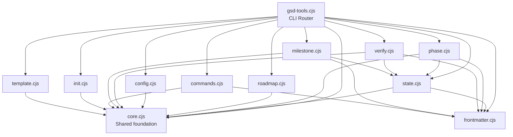

# Module: CLI Tooling (`gsd/bin/`)

> **Purpose:** Deterministic operations called by LLM agents and workflows.
> **Language:** CommonJS JavaScript (Node.js built-ins only)
> **Entry point:** `gsd/bin/gsd-tools.cjs`
> **Dependencies:** Zero npm packages — uses `fs`, `path`, `child_process`, `os`

## Architecture

## Module Reference

### `core.cjs` — Shared Foundation

Everything depends on this. Provides utilities, constants, and internal helpers.

**Key exports:**

| Export | Signature | Purpose |
|--------|-----------|---------|
| `MODEL_PROFILES` | `Object` | Agent → model mapping: `{quality, balanced, budget}` per agent |
| `output(result, raw, rawValue)` | `void` | JSON to stdout, temp file for >50KB |
| `error(message)` | `never` | stderr + `process.exit(1)` |
| `safeReadFile(path)` | `string \| null` | Read file, return null on failure |
| `loadConfig(cwd)` | `Object` | Parse `.planning/config.json` with defaults cascade |
| `execGit(cwd, args)` | `{exitCode, stdout, stderr}` | Safe git execution |
| `findPhaseInternal(cwd, phase)` | `Object \| null` | Find phase dir, plans, summaries |
| `resolveModelInternal(cwd, agent)` | `string` | Model resolution with overrides |
| `normalizePhaseName(phase)` | `string` | `"1"` → `"01"`, `"1a"` → `"01A"` |
| `comparePhaseNum(a, b)` | `number` | Sort: `1 < 1A < 1B < 1.1 < 2` |
| `getMilestoneInfo(cwd)` | `{version, name}` | Current milestone from ROADMAP.md |
| `getMilestonePhaseFilter(cwd)` | `Function` | Filter for current-milestone phases |
| `isGitIgnored(cwd, path)` | `boolean` | Check `.gitignore` status |
| `generateSlugInternal(text)` | `string \| null` | URL-safe slug |

### `state.cjs` — STATE.md Operations

**Key exports:**

| Export | Purpose |
|--------|---------|
| `cmdStateLoad(cwd, raw)` | Load full config + state |
| `cmdStateJson(cwd, raw)` | STATE.md frontmatter as JSON |
| `cmdStateUpdate(cwd, field, value)` | Update single field |
| `cmdStateGet(cwd, section, raw)` | Get field or section |
| `cmdStatePatch(cwd, patches, raw)` | Batch update fields |
| `cmdStateAdvancePlan(cwd, raw)` | Increment plan counter |
| `cmdStateRecordMetric(cwd, opts, raw)` | Record execution metrics |
| `cmdStateUpdateProgress(cwd, raw)` | Recalculate progress |
| `cmdStateAddDecision(cwd, opts, raw)` | Append decision |
| `cmdStateAddBlocker(cwd, opts, raw)` | Add blocker |
| `cmdStateResolveBlocker(cwd, text, raw)` | Remove blocker |
| `cmdStateRecordSession(cwd, opts, raw)` | Session continuity |
| `writeStateMd(path, content, cwd)` | **Gateway for all writes** — syncs frontmatter |
| `cmdStateSnapshot(cwd, raw)` | Structured parse of STATE.md |

### `phase.cjs` — Phase Lifecycle

| Export | Purpose |
|--------|---------|
| `cmdPhasesList(cwd, opts, raw)` | List phase directories/files |
| `cmdPhaseAdd(cwd, desc, raw)` | Append phase to roadmap + create dir |
| `cmdPhaseInsert(cwd, after, desc, raw)` | Insert decimal phase |
| `cmdPhaseRemove(cwd, phase, opts, raw)` | Remove phase + renumber (⚠️ fragile) |
| `cmdPhaseComplete(cwd, phase, raw)` | Mark phase done |
| `cmdPhaseNextDecimal(cwd, phase, raw)` | Calculate next decimal number |
| `cmdPhasePlanIndex(cwd, phase, raw)` | Index plans with waves + status |

### `frontmatter.cjs` — YAML Parser

| Export | Purpose |
|--------|---------|
| `extractFrontmatter(content)` | Parse `---\n...\n---` to object |
| `reconstructFrontmatter(obj)` | Object → YAML string |
| `parseMustHavesBlock(content)` | Parse must_haves section from PLAN.md |
| `cmdFrontmatterGet(cwd, file, field, raw)` | Read frontmatter field |
| `cmdFrontmatterSet(cwd, file, field, val, raw)` | Update frontmatter field |
| `cmdFrontmatterMerge(cwd, file, data, raw)` | Merge JSON into frontmatter |
| `cmdFrontmatterValidate(cwd, file, schema, raw)` | Validate against schema |

### `init.cjs` — Compound Init Commands

| Export | Purpose |
|--------|---------|
| `cmdInitExecutePhase(cwd, phase, raw)` | Context for execute-phase workflow |
| `cmdInitPlanPhase(cwd, phase, raw)` | Context for plan-phase workflow |
| `cmdInitNewProject(cwd, raw)` | Context for new-project workflow |
| `cmdInitNewMilestone(cwd, raw)` | Context for new-milestone workflow |
| `cmdInitQuick(cwd, desc, raw)` | Context for quick workflow |
| `cmdInitResume(cwd, raw)` | Context for resume-project workflow |
| `cmdInitVerifyWork(cwd, phase, raw)` | Context for verify-work workflow |
| `cmdInitPhaseOp(cwd, phase, raw)` | Generic phase operation context |
| `cmdInitTodos(cwd, area, raw)` | Context for todo workflows |
| `cmdInitMilestoneOp(cwd, raw)` | Context for milestone operations |
| `cmdInitMapCodebase(cwd, raw)` | Context for map-codebase workflow |
| `cmdInitProgress(cwd, raw)` | Context for progress workflow |

### Other Modules

| Module | Key Exports |
|--------|------------|
| `config.cjs` | `cmdConfigEnsureSection`, `cmdConfigSet`, `cmdConfigGet` |
| `verify.cjs` | `cmdVerifySummary`, `cmdVerifyPlanStructure`, `cmdVerifyPhaseCompleteness`, `cmdVerifyReferences`, `cmdVerifyCommits`, `cmdVerifyArtifacts`, `cmdVerifyKeyLinks`, `cmdValidateConsistency`, `cmdValidateHealth` |
| `roadmap.cjs` | `cmdRoadmapGetPhase`, `cmdRoadmapAnalyze`, `cmdRoadmapUpdatePlanProgress` |
| `milestone.cjs` | `cmdMilestoneComplete`, `cmdRequirementsMarkComplete` |
| `template.cjs` | `cmdTemplateFill`, `cmdTemplateSelect` |
| `commands.cjs` | `cmdCommit`, `cmdGenerateSlug`, `cmdCurrentTimestamp`, `cmdListTodos`, `cmdVerifyPathExists`, `cmdHistoryDigest`, `cmdSummaryExtract`, `cmdWebsearch`, `cmdProgressRender`, `cmdTodoComplete`, `cmdScaffold`, `cmdResolveModel` |

## How to Add a New Command

1. **Add handler** in the appropriate `lib/*.cjs` module
2. **Add routing** in `gsd-tools.cjs` `switch` statement
3. **Export** from the module
4. **Follow conventions:**
   - Function name: `cmd{Domain}{Action}(cwd, ...args, raw)`
   - Use `output(result, raw, rawValue)` for success
   - Use `error(message)` for failure
   - First parameter is always `cwd`
   - Last parameter is always `raw` (boolean)

## Common Pitfalls

- **Always use `writeStateMd()`** for STATE.md writes — never `fs.writeFileSync` directly
- **Phase names must be normalized** with `normalizePhaseName()` before directory lookups
- **Config defaults cascade** — check `loadConfig()` in `core.cjs` to understand what value you're actually getting
- **Git operations** — use `execGit()` which returns objects, never throws
- **Large JSON output** — `output()` automatically handles the >50KB temp file case
