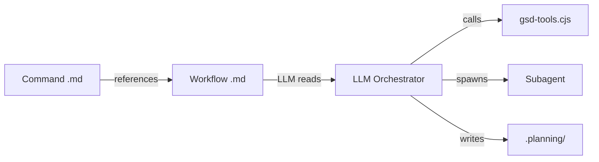

# Module: Workflows (`gsd/workflows/`)

> **Purpose:** Multi-step orchestration logic that the LLM follows as instructions.
> **Format:** Markdown with XML-like tags (`<purpose>`, `<process>`, `<step>`)
> **Count:** 30+ workflow files

## How Workflows Work

Workflows are **not code** — they're markdown instructions that the LLM reads and follows. The LLM acts as the orchestrator, executing steps in sequence, calling `gsd-tools.cjs` for deterministic operations, and spawning subagents for specialized work.



## Workflow List

### Core Workflows

| Workflow | Triggered By | Purpose |
|----------|-------------|---------|
| `new-project.md` | `/gsd:new-project` | Full project initialization |
| `plan-phase.md` | `/gsd:plan-phase` | Research → plan → verify loop |
| `execute-phase.md` | `/gsd:execute-phase` | Wave-based parallel execution |
| `execute-plan.md` | `execute-phase.md` | Single plan execution (subagent) |
| `verify-phase.md` | `verify-work.md` | Goal-backward verification |
| `quick.md` | `/gsd:quick` | Ad-hoc task execution |

### Phase Management

| Workflow | Purpose |
|----------|---------|
| `discuss-phase.md` | Capture user vision for a phase |
| `research-phase.md` | Deep domain research |
| `add-phase.md` | Append new phase |
| `insert-phase.md` | Insert decimal phase |
| `remove-phase.md` | Remove phase + renumber |

### Milestone Management

| Workflow | Purpose |
|----------|---------|
| `new-milestone.md` | Start new milestone (mirrors new-project) |
| `complete-milestone.md` | Archive milestone |
| `audit-milestone.md` | Audit milestone completion |
| `plan-milestone-gaps.md` | Create gap closure phases |

### Session & State

| Workflow | Purpose |
|----------|---------|
| `resume-project.md` | Resume from previous session |
| `pause-work.md` | Create context handoff |
| `progress.md` | Show status, route to next action |
| `transition.md` | Phase-to-phase transition |

### Utility

| Workflow | Purpose |
|----------|---------|
| `help.md` | Command reference |
| `health.md` | `.planning/` integrity check |
| `cleanup.md` | Archive old phase dirs |
| `settings.md` | Configure preferences |
| `set-profile.md` | Switch model profile |
| `map-codebase.md` | Analyze existing codebase |
| `add-todo.md` | Capture todo item |
| `check-todos.md` | List and work on todos |
| `add-tests.md` | Add tests to existing code |
| `verify-work.md` | User acceptance testing |
| `diagnose-issues.md` | Debug workflow |
| `update.md` | Update GSD version |
| `list-phase-assumptions.md` | Show planned approach |
| `discovery-phase.md` | Discovery phase workflow |

## Workflow Structure Pattern

```markdown
<purpose>
What this workflow achieves.
</purpose>

<required_reading>
Read all files referenced by the invoking prompt's execution_context.
</required_reading>

<process>

<step name="initialize" priority="first">
Load context:
```bash
INIT=$(node "$HOME/.claude/get-shit-done/bin/gsd-tools.cjs" init workflow-name args)
```
Parse JSON for: field1, field2, field3.
</step>

<step name="validate">
Check preconditions. Error if not met.
</step>

<step name="execute">
Do the work. Spawn subagents if needed.
</step>

<step name="commit">
```bash
node "$HOME/.claude/get-shit-done/bin/gsd-tools.cjs" commit "message" --files f1 f2
```
</step>

</process>
```

## Common Patterns in Workflows

### Init → Parse → Act
Every workflow starts with a `gsd-tools init` call to assemble context:
```bash
INIT=$(node "$HOME/.claude/get-shit-done/bin/gsd-tools.cjs" init execute-phase "${PHASE}")
```
The JSON result provides models, config flags, file paths, and existence checks.

### Subagent Spawning
```
Task(prompt="...", subagent_type="gsd-planner", model="{planner_model}")
```
In Pi, this maps to the `subagent` tool.

### Display Banners
```
━━━━━━━━━━━━━━━━━━━━━━━━━━━━━━━━━━━━━━━━━━━━━━━━━━━━━
 GSD ► STAGE NAME
━━━━━━━━━━━━━━━━━━━━━━━━━━━━━━━━━━━━━━━━━━━━━━━━━━━━━
```

### Git Commits
```bash
node "$HOME/.claude/get-shit-done/bin/gsd-tools.cjs" commit "message" --files f1 f2
```

## How to Add a New Workflow

1. Create `gsd/workflows/my-workflow.md`
2. Follow the `<purpose>`, `<process>`, `<step>` structure
3. Use `gsd-tools init` for context assembly
4. Create corresponding command at `commands/gsd/my-command.md`
5. Reference the workflow via `<execution_context>` in the command

## How to Modify an Existing Workflow

1. Edit the workflow `.md` file directly
2. Changes take effect immediately (commands re-read files at invocation)
3. Test by running the command
4. No compilation or restart needed (after `/reload`)
