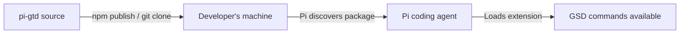

# Deployment

> **Key Takeaways:**
> - pi-gtd is distributed as a Pi extension package — no separate deployment
> - No build step required — TypeScript loaded via jiti at runtime
> - No server, no containers, no infrastructure
> - Runs inside the Pi coding agent process on the developer's machine

## Distribution Model

pi-gtd is a **local extension package** for the Pi coding agent. It's not a server, service, or standalone application.



## Installation Methods

### Method 1: npm Package

```bash
# If published to npm
npm install -g pi-gsd
```

Pi discovers packages listed in `~/.pi/agent/settings.json`:

```json
{
  "packages": ["npm:pi-gsd"]
}
```

### Method 2: Local Path

```json
{
  "packages": ["/path/to/pi-gtd"]
}
```

### Method 3: Git Repository

```json
{
  "packages": ["git:github.com/user/pi-gtd"]
}
```

## What Gets Distributed

The entire repository is the package. Key directories:

| Directory | Purpose | Required |
|-----------|---------|----------|
| `extensions/gsd/` | TypeScript extension code | Yes |
| `commands/gsd/` | Slash command definitions | Yes |
| `agents/` | Agent role definitions | Yes |
| `gsd/` | Runtime (workflows, CLI, templates, references) | Yes |
| `tests/` | Test suite | No (dev only) |
| `package.json` | Pi package metadata | Yes |

## No Build Step

The extension TypeScript is loaded via Pi's `jiti` loader — no compilation needed. This means:
- No `dist/` directory
- No build script
- No bundler
- `tsconfig.json` is for type-checking only (`npx tsc --noEmit`)

## No Infrastructure

- No database — state is filesystem
- No server — runs inside Pi process
- No containers — local Node.js execution
- No CI/CD pipeline for deployment — only for testing
- No environment-specific configuration — works the same everywhere

## Updates

Users update by re-installing:

```bash
# npm
npm install -g pi-gsd@latest

# Or via GSD's own update command
/gsd:update
```

The `/gsd:update` command (`commands/gsd/update.md`) checks for new versions, shows changelog, and runs the install.

## Why Not Deployed

pi-gtd is a development tool that runs on the developer's machine inside their Pi coding agent session. There's no server component because:

1. All state is local (`.planning/` directory)
2. All execution is local (Node.js + Git)
3. The LLM API calls are made by Pi, not by pi-gtd
4. The only external API (Brave Search) is optional and stateless
