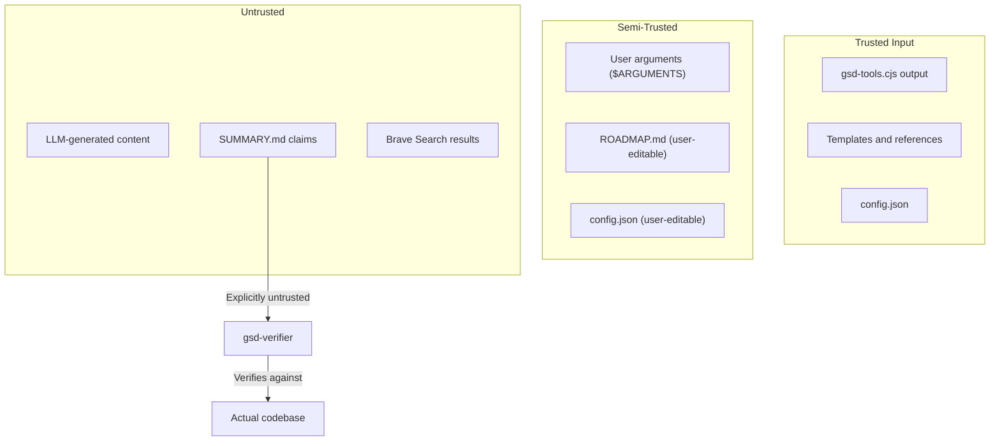

# Security & Reliability

> **Key Takeaways:**
> - Zero external runtime dependencies — minimal supply chain risk
> - Single secret: Brave API key (optional) — stored as env var or plaintext file
> - Trust boundary: LLM-generated content is explicitly untrusted by verifier
> - No retry logic, no graceful recovery — fail-fast everywhere
> - Risk: `.planning/` secrets committed to git if `commit_docs: true`

## Secrets & Configuration

### Brave Search API Key

The only secret managed by pi-gtd.

| Storage | Location | Risk |
|---------|----------|------|
| Environment variable | `BRAVE_API_KEY` | Standard, low risk |
| File | `~/.gsd/brave_api_key` | Plaintext in user home, low risk |

**No other secrets.** LLM API keys are managed by Pi, not pi-gtd.

**Evidence:** `gsd/bin/lib/init.cjs:cmdInitNewProject()`, `gsd/bin/lib/config.cjs:cmdConfigEnsureSection()`

### Secret Exposure Risk: `.planning/` in Git

When `commit_docs: true` (default), all `.planning/` files are committed to git:

**Risk scenarios:**
- Codebase mapper could include `.env` content in analysis documents
- Research outputs might reference internal APIs or credentials
- Todo items might contain sensitive context

**Mitigations:**
1. `gsd-codebase-mapper.md` has a `<forbidden_files>` section listing `.env`, credentials files
2. `map-codebase` workflow has a `scan_for_secrets` step with grep-based detection
3. `commit_docs: false` option keeps `.planning/` out of git entirely
4. `isGitIgnored()` in `core.cjs` checks gitignore before committing

**Gap:** The grep-based secret scanning is basic. Regex patterns in the workflow may miss some formats (e.g., JWTs, private keys embedded in code).

**Evidence:** `.planning/codebase/CONCERNS.md` "Secret Exposure in Generated Documents" section

## Trust Boundaries

### Key Trust Decisions

1. **SUMMARY.md is untrusted.** The verifier agent explicitly does not trust SUMMARY claims: _"SUMMARYs document what Claude SAID it did. You verify what ACTUALLY exists in the code."_ (`agents/gsd-verifier.md`)

2. **User arguments are not sanitized.** `$ARGUMENTS` is injected via `split/join` (no regex interpretation), but no validation beyond that. Phase numbers are normalized via `normalizePhaseName()`.

3. **Config values are partially validated.** `cmdConfigSet` parses booleans and numbers from strings, but there's no schema validation for the overall config structure.

4. **Git commands are escaped.** `execGit()` in `core.cjs` escapes shell arguments to prevent injection.

## Input Validation

| Input Point | Validation | Evidence |
|-------------|-----------|----------|
| `$ARGUMENTS` (user input) | None — passed through | `path-resolver.ts:injectArguments()` |
| Phase numbers | `normalizePhaseName()` padding | `core.cjs` |
| Config values | Boolean/number type parsing | `config.cjs:cmdConfigSet()` |
| File paths | `safeReadFile()` returns null on failure | `core.cjs` |
| Git arguments | Shell escaping in `execGit()` | `core.cjs` |
| JSON config | `JSON.parse()` with try/catch, fallback to defaults | `core.cjs:loadConfig()` |

## Dependency & Supply Chain

### Runtime Dependencies: Zero

pi-gtd's runtime (`gsd/bin/lib/*.cjs`) uses **only Node.js built-ins**: `fs`, `path`, `child_process`, `os`.

The extension TypeScript (`extensions/gsd/*.ts`) imports `@mariozechner/pi-coding-agent` which is provided by the Pi runtime — not installed as a dependency.

### Dev Dependencies: 2

| Package | Purpose | Risk |
|---------|---------|------|
| `tsx` ^4.0.0 | TypeScript execution for tests | Low — actively maintained |
| `typescript` ^5.0.0 | Type checking | Low — stable, widely used |

### Host Dependency

| Package | Risk |
|---------|------|
| `@mariozechner/pi-coding-agent` | **Medium** — API changes break the extension. Mitigated by compliance tests. |

**No `package-lock.json`** committed — different `npm install` runs may produce different dependency trees. Low impact since only devDependencies.

## Logging & Telemetry

**No telemetry.** pi-gtd does not phone home, track usage, or send data anywhere.

**Logging:**
- Extension load failures: `process.stderr.write("[pi-gsd] ...")` — `extensions/gsd/index.ts`
- CLI errors: `process.stderr.write("Error: ...")` → `process.exit(1)` — `gsd/bin/lib/core.cjs:error()`
- No structured logging framework
- No log levels
- No log files

## Failure Modes & Recovery

### Extension Load Failure

**Cause:** Missing `gsd/` directory or `gsd-tools.cjs`
**Impact:** No GSD commands available. Pi continues normally.
**Recovery:** Fix the missing resource, restart Pi.
**Evidence:** `extensions/gsd/index.ts` graceful degradation checks

### CLI Command Failure

**Cause:** Missing files, invalid arguments, malformed config
**Impact:** The LLM receives an error on stderr. Workflow may halt.
**Recovery:** Fix the underlying issue (create missing file, fix config JSON).
**Strategy:** Fail-fast — `error()` calls `process.exit(1)`. No retry logic.

### State Corruption

**Cause:** Direct STATE.md edits (bypassing `writeStateMd()`), interrupted writes
**Impact:** Frontmatter out of sync with body. Stale progress values.
**Recovery:** Run `node gsd/bin/gsd-tools.cjs validate health --repair`
**Prevention:** Always use `writeStateMd()` for writes.

### Git Operation Failure

**Cause:** Dirty working tree, merge conflicts, permission issues
**Impact:** Commits fail. Workflow continues but artifacts aren't tracked.
**Recovery:** Resolve git issue manually, re-run commit.
**Evidence:** `execGit()` returns `{exitCode, stdout, stderr}` — callers check `exitCode`.

### Roadmap Parse Failure

**Cause:** User-edited ROADMAP.md with unexpected format
**Impact:** Phase lookup returns `found: false`. Workflows can't find phases.
**Recovery:** Fix ROADMAP.md heading format to match `### Phase N: Name`.
**Evidence:** `core.cjs:getRoadmapPhaseInternal()` regex patterns.

### Context Window Overflow

**Cause:** Too many files read, very long workflow instructions
**Impact:** LLM can't process the full context. May miss workflow steps.
**Recovery:** Start fresh context (`/clear`), resume with `/gsd:resume-work`.
**Mitigation:** Workflows designed with "context budget" awareness (e.g., execute-phase: "~15% orchestrator, 100% fresh per subagent").

## Concurrency Safety

**No concurrent access expected.** GSD runs in a single Pi session.

**Risk:** Parallel subagents in the same wave could theoretically write to STATE.md simultaneously.

**Mitigation:** STATE.md updates happen in the orchestrator (after subagents complete), not in subagents themselves.

**Evidence:** `gsd/workflows/execute-phase.md` — orchestrator updates state between waves.
